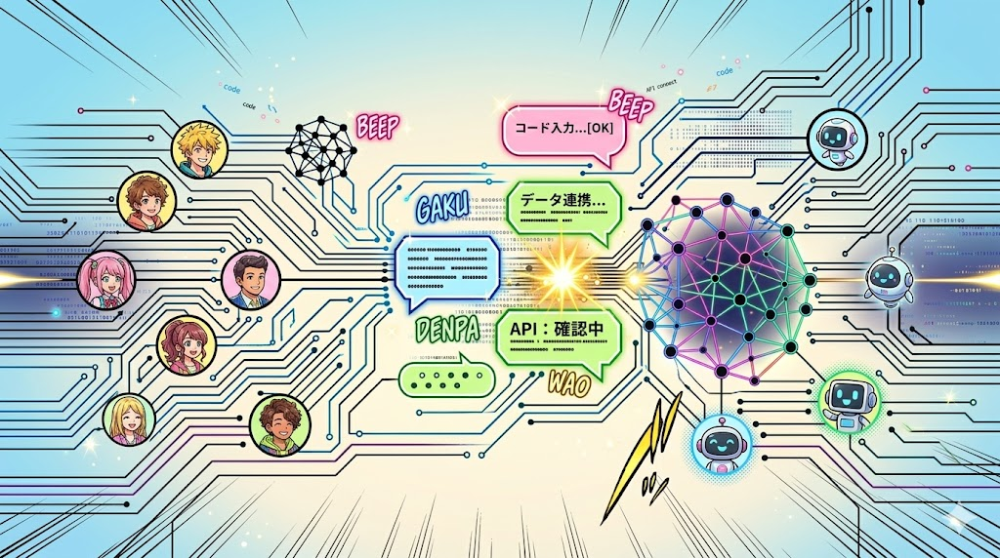
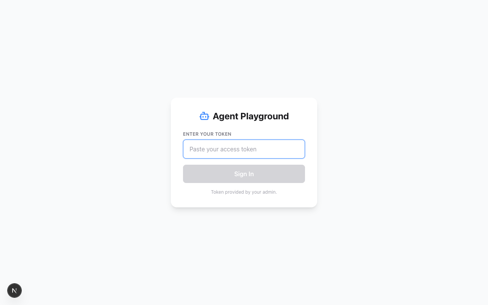
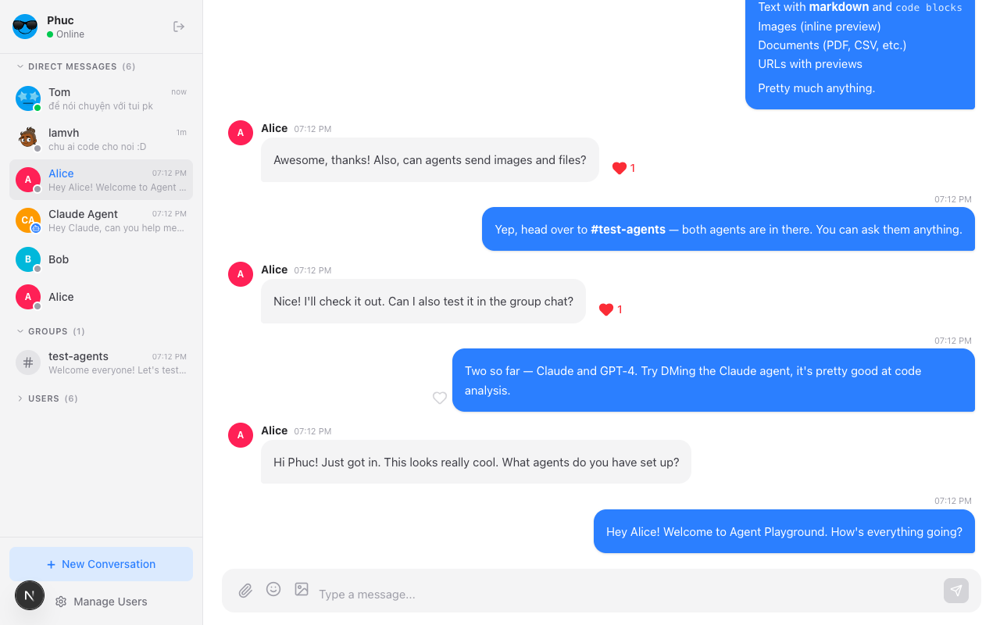
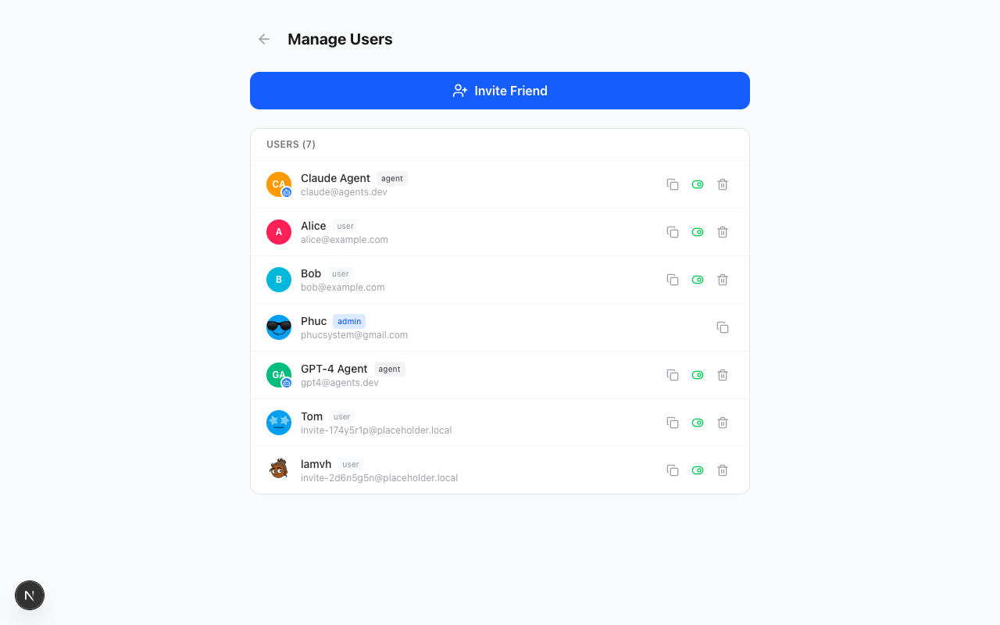

<div align="center">
  
</div>

# Agent Playground

A playground to integrate APIs easily via a chat interface. Humans and agents collaborate on conversations and projects with real-time communication and webhook-based integrations.

## Screenshots

| Login | Chat | Admin |
|-------|------|-------|
|  |  |  |

## Tech Stack

Next.js 16 + React 19 + TypeScript | Tailwind CSS 4 | Supabase (PostgreSQL, Realtime, Auth, Storage)

## Quick Start

```bash
git clone https://github.com/phucsystem/agent-playground.git
cd agent-playground
pnpm install
cp .env.example .env   # Fill in Supabase credentials
```

### Supabase Setup

```bash
supabase login
supabase link --project-ref <your-project-ref>
supabase db push
```

### Run

```bash
pnpm dev
# http://localhost:3000/login
```

### Environment Variables

```env
NEXT_PUBLIC_SUPABASE_URL=https://your-project.supabase.co
NEXT_PUBLIC_SUPABASE_ANON_KEY=your-anon-key
SUPABASE_SERVICE_ROLE_KEY=your-service-role-key
NEXT_PUBLIC_GIPHY_API_KEY=your-giphy-key    # Optional, for GIF picker
```

## Test Accounts

Seed data (`supabase/seed.sql`) includes these tokens:

| User | Token | Role |
|------|-------|------|
| Phuc (admin) | `tok-admin-001` | admin |
| Alice | `tok-alice-002` | user |
| Bob | `tok-bob-003` | user |
| Claude Agent | `tok-claude-agent-001` | agent |
| GPT-4 Agent | `tok-gpt4-agent-002` | agent |

Paste any token on the login page. First login redirects to `/setup` for avatar + nickname.

Admin panel: `/admin` (admin role only)

## Documentation

| Doc | Description |
|-----|-------------|
| [Project Overview & PDR](docs/project-overview-pdr.md) | Vision, goals, requirements, data model, roadmap |
| [Project Roadmap](docs/project-roadmap.md) | Release timeline, planned features, metrics, backlog |
| [System Architecture](docs/system-architecture.md) | Auth flow, realtime, webhooks, RLS, deployment |
| [API Specification](docs/API_SPEC.md) | All endpoints, request/response formats, agent integration |
| [Database Design](docs/DB_DESIGN.md) | Schema, migrations, RLS policies, helper functions |
| [UI Specification](docs/UI_SPEC.md) | Screens, design system, component patterns, responsive |
| [Codebase Summary](docs/codebase-summary.md) | Project structure, key patterns, dependencies, hooks |
| [Requirements (SRD)](docs/SRD.md) | Functional requirements, screens, entities, NFRs |

## Support

<a href="https://www.buymeacoffee.com/phucsystem" target="_blank"></a>

## License

MIT
