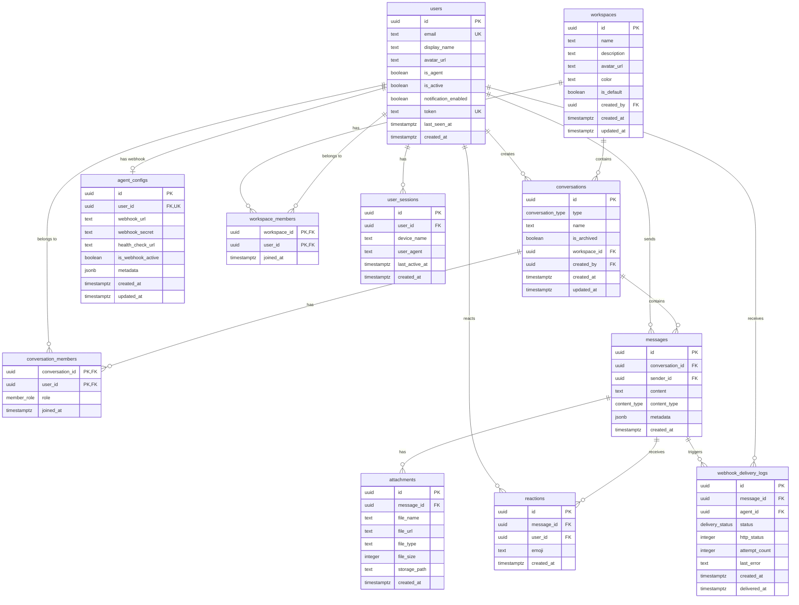

# Database Detailed Design

**Backend:** Supabase (PostgreSQL)
**Auth:** Token-based (admin-provisioned), Supabase Auth for JWT sessions
**Realtime:** Supabase Realtime (Postgres Changes + Presence + Broadcast)

## 1. ER Diagram



## 2. Custom Types

```sql
-- User role enum
CREATE TYPE user_role AS ENUM ('admin', 'user', 'agent');

-- Conversation type enum
CREATE TYPE conversation_type AS ENUM ('dm', 'group');

-- Member role enum
CREATE TYPE member_role AS ENUM ('admin', 'member');

-- Content type enum
CREATE TYPE content_type AS ENUM ('text', 'file', 'image', 'url');

-- Webhook delivery status enum (Phase 5)
CREATE TYPE delivery_status AS ENUM ('pending', 'delivered', 'failed');
```

## 3. Table Definitions

### E-01: users

Stores human users and AI agents. Admin generates tokens via UI (no name/email input needed).

| Column | Type | Constraints | Default | Description |
|--------|------|-------------|---------|-------------|
| `id` | `uuid` | PK | `gen_random_uuid()` | Unique user ID |
| `email` | `text` | UNIQUE, NOT NULL | — | Auto-generated as `invite-{shortId}@placeholder.local` for invites; user unchanged on setup. |
| `display_name` | `text` | NOT NULL | — | Defaults to "New User" for invites; user customizes on /setup. Shown in chat. |
| `avatar_url` | `text` | NULLABLE | `NULL` | NULL until user selects DiceBear style on /setup. DiceBear or external URL. |
| `role` | `user_role` | NOT NULL | `'user'` | `admin` (manage platform), `user` (chat), or `agent` (API-only) |
| `is_mock` | `boolean` | NOT NULL | `false` | True = hidden from non-admin users. Used for testing. |
| `is_active` | `boolean` | NOT NULL | `true` | Admin toggle. False = cannot log in |
| `token` | `text` | UNIQUE, NOT NULL | — | Pre-provisioned auth token (64-char with charset: A-Za-z0-9!@#$%^&*()-_=+[]{}|;:<>?, generated via crypto.getRandomValues). Cached in localStorage. |
| `notification_enabled` | `boolean` | NOT NULL | `true` | Whether push/in-app notifications are enabled for this user |
| `is_agent` | `boolean` | NOT NULL | `false` | Derived convenience flag mirroring `role = 'agent'`. Kept for webhook trigger compatibility. |
| `last_seen_at` | `timestamptz` | NULLABLE | `NULL` | Last activity timestamp (updated on disconnect) |
| `created_at` | `timestamptz` | NOT NULL | `now()` | Account creation time |

**Indexes:**
- `idx_users_token` — UNIQUE on `token` (login lookup)
- `idx_users_email` — UNIQUE on `email`
- `idx_users_is_active` — on `is_active` (filter active users)

---

### E-02: conversations

Container for DM (2 participants) or group (3+) conversations.

| Column | Type | Constraints | Default | Description |
|--------|------|-------------|---------|-------------|
| `id` | `uuid` | PK | `gen_random_uuid()` | Conversation ID |
| `type` | `conversation_type` | NOT NULL | — | `dm` or `group` |
| `name` | `text` | NULLABLE | `NULL` | Group name. NULL for DMs. |
| `is_archived` | `boolean` | NOT NULL | `false` | Soft-archive flag. Archived conversations hidden from sidebar by default. |
| `workspace_id` | `uuid` | FK → workspaces(id), NULLABLE | `NULL` | Workspace this conversation belongs to. NULL = global/legacy. |
| `created_by` | `uuid` | FK → users(id), NOT NULL | — | User who created the conversation |
| `created_at` | `timestamptz` | NOT NULL | `now()` | Creation timestamp |
| `updated_at` | `timestamptz` | NOT NULL | `now()` | Last message timestamp (for sort order) |

**Indexes:**
- `idx_conversations_updated_at` — on `updated_at DESC` (sidebar sort)
- `idx_conversations_created_by` — on `created_by`

**Trigger:**
- `update_conversation_updated_at` — After INSERT on `messages`, update `conversations.updated_at = now()` for the conversation.

---

### E-03: conversation_members

Join table linking users to conversations. Enforces access control.

| Column | Type | Constraints | Default | Description |
|--------|------|-------------|---------|-------------|
| `conversation_id` | `uuid` | PK, FK → conversations(id) ON DELETE CASCADE | — | Conversation reference |
| `user_id` | `uuid` | PK, FK → users(id) ON DELETE CASCADE | — | User reference |
| `role` | `member_role` | NOT NULL | `'member'` | `admin` (can manage members) or `member` |
| `joined_at` | `timestamptz` | NOT NULL | `now()` | When user joined |
| `last_read_at` | `timestamptz` | NULLABLE | `NULL` | Last message timestamp user has read (for unread count) |

**Indexes:**
- PK: `(conversation_id, user_id)`
- `idx_members_user_id` — on `user_id` (find user's conversations)

---

### E-04: messages

Chat messages. Content can be text (with markdown), file reference, image reference, or URL.

| Column | Type | Constraints | Default | Description |
|--------|------|-------------|---------|-------------|
| `id` | `uuid` | PK | `gen_random_uuid()` | Message ID |
| `conversation_id` | `uuid` | FK → conversations(id) ON DELETE CASCADE, NOT NULL | — | Parent conversation |
| `sender_id` | `uuid` | FK → users(id), NOT NULL | — | Message author |
| `content` | `text` | NOT NULL | — | Message text (markdown for text type, URL for url type) |
| `content_type` | `content_type` | NOT NULL | `'text'` | `text`, `file`, `image`, `url` |
| `metadata` | `jsonb` | NULLABLE | `NULL` | Extra data (OG preview, file info, etc.) |
| `created_at` | `timestamptz` | NOT NULL | `now()` | Send timestamp |

**Indexes:**
- `idx_messages_conversation_created` — on `(conversation_id, created_at DESC)` (message history pagination)
- `idx_messages_sender_id` — on `sender_id`

**metadata JSONB schema by content_type:**

| content_type | metadata fields |
|---|---|
| `text` | `null` |
| `file` | `{ "file_name": "doc.pdf", "file_size": 245000, "file_type": "application/pdf" }` |
| `image` | `{ "file_name": "photo.jpg", "width": 1200, "height": 800, "file_size": 150000 }` |
| `url` | `{ "og_title": "...", "og_description": "...", "og_image": "...", "favicon": "..." }` |

---

### E-05: attachments

Files uploaded to Supabase Storage and linked to messages.

| Column | Type | Constraints | Default | Description |
|--------|------|-------------|---------|-------------|
| `id` | `uuid` | PK | `gen_random_uuid()` | Attachment ID |
| `message_id` | `uuid` | FK → messages(id) ON DELETE CASCADE, NOT NULL | — | Parent message |
| `file_name` | `text` | NOT NULL | — | Original file name |
| `file_url` | `text` | NOT NULL | — | Supabase Storage public/signed URL |
| `file_type` | `text` | NOT NULL | — | MIME type (e.g. `image/png`, `application/pdf`) |
| `file_size` | `integer` | NOT NULL | — | File size in bytes |
| `storage_path` | `text` | NOT NULL | — | Supabase Storage path (e.g. `attachments/{conversation_id}/{uuid}.ext`) |
| `created_at` | `timestamptz` | NOT NULL | `now()` | Upload timestamp |

**Indexes:**
- `idx_attachments_message_id` — on `message_id`
- `idx_attachments_conversation` — on storage_path prefix (for shared files query)

**Storage bucket:** `attachments`
- Path pattern: `{conversation_id}/{message_id}/{filename}`
- Max file size: 10MB
- Allowed MIME types: `image/jpeg`, `image/png`, `image/gif`, `image/webp`, `application/pdf`, `text/plain`, `text/markdown`, `text/csv`

---

### E-06: reactions (Phase 3)

Emoji reactions on messages.

| Column | Type | Constraints | Default | Description |
|--------|------|-------------|---------|-------------|
| `id` | `uuid` | PK | `gen_random_uuid()` | Reaction ID |
| `message_id` | `uuid` | FK → messages(id) ON DELETE CASCADE, NOT NULL | — | Target message |
| `user_id` | `uuid` | FK → users(id) ON DELETE CASCADE, NOT NULL | — | User who reacted |
| `emoji` | `text` | NOT NULL | — | Emoji character (e.g. `👍`, `❤️`, `🎉`) |
| `created_at` | `timestamptz` | NOT NULL | `now()` | Reaction timestamp |

**Constraints:**
- UNIQUE: `(message_id, user_id, emoji)` — one reaction type per user per message

**Indexes:**
- `idx_reactions_message_id` — on `message_id` (load reactions for messages)

### E-07: agent_configs (Phase 5)

Webhook configuration per agent user. One-to-one with users (only agent users). Created during agent token generation in admin page.

| Column | Type | Constraints | Default | Description |
|--------|------|-------------|---------|-------------|
| `id` | `uuid` | PK | `gen_random_uuid()` | Config ID |
| `user_id` | `uuid` | FK → users(id) ON DELETE CASCADE, UNIQUE, NOT NULL | — | Agent user reference. One config per agent. |
| `webhook_url` | `text` | NOT NULL | — | HTTPS URL where message payloads are POSTed. Validated as valid URL on insert. |
| `webhook_secret` | `text` | NULLABLE | `NULL` | Shared secret for HMAC-SHA256 signature. If set, `X-Webhook-Signature` header included in requests. |
| `health_check_url` | `text` | NULLABLE | `NULL` | Optional URL polled to check if the agent is reachable/healthy. |
| `is_webhook_active` | `boolean` | NOT NULL | `true` | Admin toggle. False = agent stays in conversations but receives no webhooks. |
| `metadata` | `jsonb` | NULLABLE | `'{}'` | Extensible configuration for agent integrations. Used by GoClaw bridge: `{ "goclaw_agent_key": "agent-key-uuid" }`. |
| `created_at` | `timestamptz` | NOT NULL | `now()` | Config creation time |
| `updated_at` | `timestamptz` | NOT NULL | `now()` | Last modification time |

**Indexes:**
- `idx_agent_configs_user_id` — UNIQUE on `user_id` (one config per agent)

**Constraints:**
- `webhook_url` must start with `https://` (CHECK constraint)
- `user_id` must reference a user with `is_agent = true` (enforced by application logic, not FK constraint — keeps schema simpler)

---

### E-08: webhook_delivery_logs (Phase 5)

Tracks each webhook delivery attempt per message per agent. Used for admin debugging (S-08).

| Column | Type | Constraints | Default | Description |
|--------|------|-------------|---------|-------------|
| `id` | `uuid` | PK | `gen_random_uuid()` | Log entry ID |
| `message_id` | `uuid` | FK → messages(id) ON DELETE CASCADE, NOT NULL | — | The message that triggered the webhook |
| `agent_id` | `uuid` | FK → users(id) ON DELETE CASCADE, NOT NULL | — | The agent whose webhook was called |
| `status` | `delivery_status` | NOT NULL | `'pending'` | `pending` → `delivered` or `failed` |
| `http_status` | `integer` | NULLABLE | `NULL` | HTTP response status code (200, 500, etc.). NULL if timeout or connection error. |
| `attempt_count` | `integer` | NOT NULL | `0` | Number of delivery attempts (max 3) |
| `last_error` | `text` | NULLABLE | `NULL` | Error message from last failed attempt. e.g., "Connection timed out after 30s", "500 Internal Server Error" |
| `created_at` | `timestamptz` | NOT NULL | `now()` | When the webhook was first triggered |
| `delivered_at` | `timestamptz` | NULLABLE | `NULL` | When delivery succeeded. NULL if still pending or failed. |
| `request_payload` | `jsonb` | NULLABLE | `NULL` | Full request payload sent to webhook URL (debug support, added in M-008) |
| `response_body` | `text` | NULLABLE | `NULL` | Response body from agent webhook (debug support, added in M-008) |
| `webhook_url` | `text` | NULLABLE | `NULL` | URL webhook was POSTed to (debug support, added in M-008) |

**Indexes:**
- `idx_webhook_logs_agent_created` — on `(agent_id, created_at DESC)` (filter by agent + time range in S-08)
- `idx_webhook_logs_status` — on `status` (filter delivered/failed)
- `idx_webhook_logs_message_id` — on `message_id` (lookup by message)

**Retention:** Consider auto-deleting logs older than 30 days via scheduled cron job to prevent unbounded growth.

---

### E-09: workspaces

Multi-workspace support. Each workspace is an isolated group of conversations and members.

| Column | Type | Constraints | Default | Description |
|--------|------|-------------|---------|-------------|
| `id` | `uuid` | PK | `gen_random_uuid()` | Workspace ID |
| `name` | `text` | NOT NULL | — | Workspace name |
| `description` | `text` | NULLABLE | `NULL` | Workspace description |
| `avatar_url` | `text` | NULLABLE | `NULL` | Custom workspace avatar |
| `color` | `text` | NULLABLE | `NULL` | Hex color for workspace avatar fallback |
| `is_default` | `boolean` | NOT NULL | `false` | Default workspace (auto-joined) |
| `created_by` | `uuid` | FK → users(id), NOT NULL | — | Creator |
| `created_at` | `timestamptz` | NOT NULL | `now()` | Creation time |
| `updated_at` | `timestamptz` | NOT NULL | `now()` | Last update |

**Indexes:**
- `idx_workspaces_created_by` — on `created_by`
- `idx_workspaces_is_default` — on `is_default` (fast default workspace lookup)

---

### E-10: workspace_members

Join table linking users to workspaces.

| Column | Type | Constraints | Default | Description |
|--------|------|-------------|---------|-------------|
| `workspace_id` | `uuid` | PK, FK → workspaces(id) ON DELETE CASCADE | — | Workspace reference |
| `user_id` | `uuid` | PK, FK → users(id) ON DELETE CASCADE | — | User reference |
| `joined_at` | `timestamptz` | NOT NULL | `now()` | When user joined |

**Indexes:**
- PK: `(workspace_id, user_id)`
- `idx_workspace_members_user_id` — on `user_id` (find user's workspaces)

---

### E-11: user_sessions

Tracks multi-device login sessions. Max 3 active sessions per user.

| Column | Type | Constraints | Default | Description |
|--------|------|-------------|---------|-------------|
| `id` | `uuid` | PK | `gen_random_uuid()` | Session ID |
| `user_id` | `uuid` | FK → users(id) ON DELETE CASCADE, NOT NULL | — | User reference |
| `device_name` | `text` | NULLABLE | `NULL` | Detected device name from user agent |
| `user_agent` | `text` | NULLABLE | `NULL` | Raw user agent string |
| `last_active_at` | `timestamptz` | NOT NULL | `now()` | Last activity timestamp |
| `created_at` | `timestamptz` | NOT NULL | `now()` | Session creation time |

**Indexes:**
- `idx_user_sessions_user_id` — on `user_id`
- `idx_user_sessions_last_active` — on `(user_id, last_active_at DESC)` (enforce max-session eviction)

**Constraints:**
- Max 3 active sessions per user enforced at application layer (evict oldest on 4th login).

---

## 4. Helper Views & Functions

### users_public view

Exposes user data without sensitive `token` column:

```sql
CREATE VIEW users_public AS
SELECT id, email, display_name, avatar_url, role, is_mock, is_active,
       notification_enabled, is_agent, last_seen_at, created_at
FROM users;
```

**Purpose:** Frontend queries `users_public` instead of `users` to prevent accidental token exposure.

### SECURITY DEFINER Helper Functions

Prevent RLS recursion when policies reference other tables:

```sql
-- Check if current user is admin
CREATE OR REPLACE FUNCTION is_admin()
RETURNS boolean AS $$
BEGIN
  RETURN (SELECT role = 'admin' FROM users WHERE id = auth.uid());
END;
$$ LANGUAGE plpgsql SECURITY DEFINER;

-- Get conversation IDs where user is member
CREATE OR REPLACE FUNCTION my_conversation_ids()
RETURNS TABLE(conversation_id uuid) AS $$
BEGIN
  RETURN QUERY
  SELECT conversation_members.conversation_id
  FROM conversation_members
  WHERE conversation_members.user_id = auth.uid();
END;
$$ LANGUAGE plpgsql SECURITY DEFINER;

-- Check membership without recursion
CREATE OR REPLACE FUNCTION is_conversation_member(conv_id uuid)
RETURNS boolean AS $$
BEGIN
  RETURN EXISTS(
    SELECT 1 FROM conversation_members
    WHERE conversation_id = conv_id AND user_id = auth.uid()
  );
END;
$$ LANGUAGE plpgsql SECURITY DEFINER;

-- Check admin status in conversation
CREATE OR REPLACE FUNCTION is_conversation_admin(conv_id uuid)
RETURNS boolean AS $$
BEGIN
  RETURN EXISTS(
    SELECT 1 FROM conversation_members
    WHERE conversation_id = conv_id AND user_id = auth.uid() AND role = 'admin'
  );
END;
$$ LANGUAGE plpgsql SECURITY DEFINER;
```

**Why SECURITY DEFINER:** RLS policies cannot directly query conversation_members (would cause circular dependency). DEFINER functions execute as schema owner, bypassing RLS.

### Workspace RPC Helper Functions

```sql
-- Check if current user is member of a workspace
CREATE OR REPLACE FUNCTION is_workspace_member(ws_id uuid)
RETURNS boolean AS $$
BEGIN
  RETURN EXISTS(
    SELECT 1 FROM workspace_members
    WHERE workspace_id = ws_id AND user_id = auth.uid()
  );
END;
$$ LANGUAGE plpgsql SECURITY DEFINER;

-- Return workspace IDs for current user
CREATE OR REPLACE FUNCTION my_workspace_ids()
RETURNS TABLE(workspace_id uuid) AS $$
BEGIN
  RETURN QUERY
  SELECT workspace_members.workspace_id
  FROM workspace_members
  WHERE workspace_members.user_id = auth.uid();
END;
$$ LANGUAGE plpgsql SECURITY DEFINER;

-- Return member user IDs for a workspace
CREATE OR REPLACE FUNCTION workspace_member_ids(ws_id uuid)
RETURNS TABLE(user_id uuid) AS $$
BEGIN
  RETURN QUERY
  SELECT workspace_members.user_id
  FROM workspace_members
  WHERE workspace_members.workspace_id = ws_id;
END;
$$ LANGUAGE plpgsql SECURITY DEFINER;

-- Find or create a DM within a workspace
CREATE OR REPLACE FUNCTION find_or_create_dm(other_user_id uuid, ws_id uuid DEFAULT NULL)
RETURNS uuid AS $$
DECLARE
  existing_id uuid;
  new_id uuid;
BEGIN
  SELECT cm1.conversation_id INTO existing_id
  FROM conversation_members cm1
  JOIN conversation_members cm2 ON cm1.conversation_id = cm2.conversation_id
  JOIN conversations c ON c.id = cm1.conversation_id
  WHERE cm1.user_id = auth.uid()
    AND cm2.user_id = other_user_id
    AND c.type = 'dm'
    AND (ws_id IS NULL OR c.workspace_id = ws_id);

  IF existing_id IS NOT NULL THEN
    RETURN existing_id;
  END IF;

  INSERT INTO conversations (type, created_by, workspace_id)
  VALUES ('dm', auth.uid(), ws_id)
  RETURNING id INTO new_id;

  INSERT INTO conversation_members (conversation_id, user_id, role)
  VALUES
    (new_id, auth.uid(), 'admin'),
    (new_id, other_user_id, 'member');

  RETURN new_id;
END;
$$ LANGUAGE plpgsql SECURITY DEFINER;

-- Create a group conversation within a workspace
CREATE OR REPLACE FUNCTION create_group(group_name text, member_ids uuid[], ws_id uuid DEFAULT NULL)
RETURNS uuid AS $$
DECLARE
  new_id uuid;
  member_id uuid;
BEGIN
  INSERT INTO conversations (type, name, created_by, workspace_id)
  VALUES ('group', group_name, auth.uid(), ws_id)
  RETURNING id INTO new_id;

  INSERT INTO conversation_members (conversation_id, user_id, role)
  VALUES (new_id, auth.uid(), 'admin');

  FOREACH member_id IN ARRAY member_ids LOOP
    IF member_id != auth.uid() THEN
      INSERT INTO conversation_members (conversation_id, user_id, role)
      VALUES (new_id, member_id, 'member');
    END IF;
  END LOOP;

  RETURN new_id;
END;
$$ LANGUAGE plpgsql SECURITY DEFINER;

-- Get conversations for current user filtered by workspace
CREATE OR REPLACE FUNCTION get_my_conversations(ws_id uuid DEFAULT NULL)
RETURNS TABLE(conversation_id uuid) AS $$
BEGIN
  RETURN QUERY
  SELECT cm.conversation_id
  FROM conversation_members cm
  JOIN conversations c ON c.id = cm.conversation_id
  WHERE cm.user_id = auth.uid()
    AND (ws_id IS NULL OR c.workspace_id = ws_id)
    AND c.is_archived = false;
END;
$$ LANGUAGE plpgsql SECURITY DEFINER;
```

### Storage Buckets

| Bucket | Access | Max Size | Types | Purpose |
|--------|--------|----------|-------|---------|
| `attachments` | Private (signed URLs) | 5MB | All except executables | Message file attachments |
| `avatars` | Public | 5MB | WebP, JPEG, PNG | User profile avatars |

---

## 5. Row Level Security (RLS)

All tables have RLS enabled. Policies use `auth.uid()` from Supabase Auth JWT. Helper functions prevent recursion.

### users

```sql
-- Users can read active users, but admins see all including mocks
CREATE POLICY "users_select" ON users FOR SELECT
  USING (is_active = true AND (is_mock = false OR is_admin()));

-- Users can update their own record (last_seen_at, avatar_url, display_name)
CREATE POLICY "users_update_self" ON users FOR UPDATE
  USING (auth.uid() = id)
  WITH CHECK (auth.uid() = id);

-- Only admins can manage users (enable/disable/delete)
CREATE POLICY "users_delete_admin" ON users FOR DELETE
  USING (is_admin());
```

### conversations

```sql
-- Users can see conversations they are a member of (using DEFINER helper)
CREATE POLICY "conversations_select" ON conversations FOR SELECT
  USING (id = ANY(my_conversation_ids()));

-- Any active user can create a conversation
CREATE POLICY "conversations_insert" ON conversations FOR INSERT
  WITH CHECK (auth.uid() = created_by);
```

### conversation_members

```sql
-- Users can see members of their own conversations (using DEFINER helper)
CREATE POLICY "members_select" ON conversation_members FOR SELECT
  USING (is_conversation_member(conversation_id));

-- Conversation admins can add members (using DEFINER helper)
CREATE POLICY "members_insert" ON conversation_members FOR INSERT
  WITH CHECK (is_conversation_admin(conversation_id));

-- Conversation admins can remove members (or self-leave)
CREATE POLICY "members_delete" ON conversation_members FOR DELETE
  USING (
    user_id = auth.uid()
    OR is_conversation_admin(conversation_id)
  );
```

### messages

```sql
-- Users can read messages in their conversations (using DEFINER helper)
CREATE POLICY "messages_select" ON messages FOR SELECT
  USING (is_conversation_member(conversation_id));

-- Users can send messages to their conversations
CREATE POLICY "messages_insert" ON messages FOR INSERT
  WITH CHECK (
    auth.uid() = sender_id
    AND is_conversation_member(conversation_id)
  );
```

### attachments

```sql
-- Users can see attachments in their conversations (using DEFINER helper)
CREATE POLICY "attachments_select" ON attachments FOR SELECT
  USING (is_conversation_member((
    SELECT conversation_id FROM messages WHERE id = message_id
  )));

-- Users can create attachments for their own messages
CREATE POLICY "attachments_insert" ON attachments FOR INSERT
  WITH CHECK (
    auth.uid() = (SELECT sender_id FROM messages WHERE id = message_id)
  );
```

### reactions (Phase 3)

```sql
-- Users can see reactions in their conversations
CREATE POLICY "reactions_select" ON reactions FOR SELECT
  USING (message_id IN (
    SELECT id FROM messages WHERE conversation_id IN (
      SELECT conversation_id FROM conversation_members WHERE user_id = auth.uid()
    )
  ));

-- Users can add reactions
CREATE POLICY "reactions_insert" ON reactions FOR INSERT
  WITH CHECK (auth.uid() = user_id);

-- Users can remove their own reactions
CREATE POLICY "reactions_delete" ON reactions FOR DELETE
  USING (auth.uid() = user_id);
```

### agent_configs (Phase 5)

```sql
-- Only admins can read webhook configs
CREATE POLICY "agent_configs_select" ON agent_configs FOR SELECT
  USING (is_admin());

-- Only admins can create webhook configs
CREATE POLICY "agent_configs_insert" ON agent_configs FOR INSERT
  WITH CHECK (is_admin());

-- Only admins can update webhook configs
CREATE POLICY "agent_configs_update" ON agent_configs FOR UPDATE
  USING (is_admin())
  WITH CHECK (is_admin());

-- Only admins can delete webhook configs
CREATE POLICY "agent_configs_delete" ON agent_configs FOR DELETE
  USING (is_admin());
```

### webhook_delivery_logs (Phase 5)

```sql
-- Only admins can read delivery logs
CREATE POLICY "webhook_logs_select" ON webhook_delivery_logs FOR SELECT
  USING (is_admin());

-- Edge Function inserts logs via service role key (bypasses RLS)
-- No INSERT policy needed for regular users
```

**Note:** The webhook dispatch Edge Function uses the `service_role` key to insert delivery logs, bypassing RLS. This is intentional — only the system should create log entries.

## 6. Supabase Storage Policies

**Bucket:** `attachments`

**Security:** Use signed URLs (`createSignedUrl`) instead of public URLs. Paths scoped to conversation membership via DEFINER helper.

```sql
-- Members can upload to their conversation's folder
CREATE POLICY "attachments_upload" ON storage.objects FOR INSERT
  WITH CHECK (
    bucket_id = 'attachments'
    AND (storage.foldername(name))[1]::uuid = ANY(my_conversation_ids())
  );

-- Members can read files from their conversations
CREATE POLICY "attachments_read" ON storage.objects FOR SELECT
  USING (
    bucket_id = 'attachments'
    AND (storage.foldername(name))[1]::uuid = ANY(my_conversation_ids())
  );
```

**URL Generation (Frontend):**
```typescript
// Instead of getPublicUrl(), use createSignedUrl for secure access
const { data } = await supabase.storage
  .from('attachments')
  .createSignedUrl(filePath, 3600); // 1-hour expiry
const signedUrl = data?.signedUrl;
```

## 7. Database Migrations

| File | Status | Changes |
|------|--------|---------|
| `001_initial_schema.sql` | ✅ Applied | Create all tables, enums, indexes, RLS, functions |
| `002_user_role.sql` | ✅ Applied | Add `role` (user_role enum) column to users |
| `003_admin_management.sql` | ✅ Applied | Add admin-only functions for user management |
| `004_mock_flag.sql` | ✅ Applied | Add `is_mock` boolean column, update presence RLS |
| `005_security_fixes.sql` | ✅ Applied | Add SECURITY DEFINER helpers, users_public view, update storage to signed URLs |
| `006_fix_rls_recursion.sql` | ✅ Applied | Replace recursive RLS policies with DEFINER helpers |
| `007_agent_webhooks.sql` | ✅ Applied | Create `delivery_status` enum, `agent_configs` table, `webhook_delivery_logs` table, RLS policies, `notify_webhook_dispatch` trigger |
| `008_webhook_debug_columns.sql` | ✅ Applied (Idempotent) | Add `request_payload` (jsonb), `response_body` (text), `webhook_url` (text) columns to `webhook_delivery_logs` (debug support). Includes IF NOT EXISTS guards. |
| ... (migrations 009-022 omitted for brevity) | ✅ Applied | Various features: group creation, user sessions, agent health checks, notifications, workspaces, avatar storage |
| `023_agent_configs_metadata.sql` | ✅ Applied | Add `metadata` (jsonb DEFAULT '{}') column to `agent_configs` for extensible agent integration config (GoClaw support) |

**Running Migrations:**
```bash
supabase db push  # Runs all migrations in order
```

---

## 8. Database Functions

### Find or create DM conversation

```sql
CREATE OR REPLACE FUNCTION find_or_create_dm(other_user_id uuid)
RETURNS uuid AS $$
DECLARE
  existing_id uuid;
  new_id uuid;
BEGIN
  -- Check if DM already exists between these two users
  SELECT cm1.conversation_id INTO existing_id
  FROM conversation_members cm1
  JOIN conversation_members cm2 ON cm1.conversation_id = cm2.conversation_id
  JOIN conversations c ON c.id = cm1.conversation_id
  WHERE cm1.user_id = auth.uid()
    AND cm2.user_id = other_user_id
    AND c.type = 'dm';

  IF existing_id IS NOT NULL THEN
    RETURN existing_id;
  END IF;

  -- Create new DM
  INSERT INTO conversations (type, created_by)
  VALUES ('dm', auth.uid())
  RETURNING id INTO new_id;

  -- Add both members
  INSERT INTO conversation_members (conversation_id, user_id, role)
  VALUES
    (new_id, auth.uid(), 'admin'),
    (new_id, other_user_id, 'member');

  RETURN new_id;
END;
$$ LANGUAGE plpgsql SECURITY DEFINER;
```

### Get unread count per conversation

```sql
CREATE OR REPLACE FUNCTION get_unread_counts()
RETURNS TABLE(conversation_id uuid, unread_count bigint) AS $$
BEGIN
  RETURN QUERY
  SELECT
    cm.conversation_id,
    COUNT(m.id) AS unread_count
  FROM conversation_members cm
  LEFT JOIN messages m ON m.conversation_id = cm.conversation_id
    AND m.created_at > COALESCE(cm.last_read_at, '1970-01-01'::timestamptz)
    AND m.sender_id != auth.uid()
  WHERE cm.user_id = auth.uid()
  GROUP BY cm.conversation_id;
END;
$$ LANGUAGE plpgsql SECURITY DEFINER;
```

### Update last_read_at

```sql
CREATE OR REPLACE FUNCTION mark_conversation_read(conv_id uuid)
RETURNS void AS $$
BEGIN
  UPDATE conversation_members
  SET last_read_at = now()
  WHERE conversation_id = conv_id AND user_id = auth.uid();
END;
$$ LANGUAGE plpgsql SECURITY DEFINER;
```

### Webhook dispatch trigger (Phase 5)

Database trigger that notifies the Edge Function when a new message is inserted:

```sql
-- Notify Edge Function on new message (for webhook dispatch)
CREATE OR REPLACE FUNCTION notify_webhook_dispatch()
RETURNS trigger AS $$
DECLARE
  sender_is_agent boolean;
BEGIN
  -- Check if sender is an agent (skip agent-sent messages to prevent loops)
  SELECT is_agent INTO sender_is_agent FROM users WHERE id = NEW.sender_id;

  IF sender_is_agent = true THEN
    RETURN NEW; -- Skip: agents don't trigger webhooks (prevents loops)
  END IF;

  -- Check if conversation has any agent members with active webhooks
  IF EXISTS (
    SELECT 1
    FROM conversation_members cm
    JOIN agent_configs ac ON ac.user_id = cm.user_id
    WHERE cm.conversation_id = NEW.conversation_id
      AND ac.is_webhook_active = true
      AND cm.user_id != NEW.sender_id
  ) THEN
    -- Notify via pg_notify for Edge Function to pick up
    PERFORM pg_notify('webhook_dispatch', json_build_object(
      'message_id', NEW.id,
      'conversation_id', NEW.conversation_id,
      'sender_id', NEW.sender_id
    )::text);
  END IF;

  RETURN NEW;
END;
$$ LANGUAGE plpgsql SECURITY DEFINER;

CREATE TRIGGER trigger_webhook_dispatch
  AFTER INSERT ON messages
  FOR EACH ROW
  EXECUTE FUNCTION notify_webhook_dispatch();
```

**Note:** The trigger only fires `pg_notify` — the actual HTTP webhook call is handled by the Supabase Edge Function (`supabase/functions/webhook-dispatch/index.ts`), which listens for the notification and performs the HTTP POST with retry logic.

---

## 9. Realtime Configuration

### Postgres Changes (message delivery)

```sql
-- Enable realtime on messages table
ALTER PUBLICATION supabase_realtime ADD TABLE messages;
```

Frontend subscribes per conversation:
```
supabase.channel('messages:{conversation_id}')
  .on('postgres_changes', { event: 'INSERT', schema: 'public', table: 'messages', filter: 'conversation_id=eq.{id}' })
```

### Presence (online status)

Frontend tracks presence via a shared channel:
```
supabase.channel('presence')
  .on('presence', { event: 'sync' })
  .on('presence', { event: 'join' })
  .on('presence', { event: 'leave' })
  .subscribe()
```

### Broadcast (typing indicators — Phase 3)

```
supabase.channel('typing:{conversation_id}')
  .on('broadcast', { event: 'typing' })
  .subscribe()
```

## 10. Traceability

| Entity | SRD ID | Features |
|--------|--------|----------|
| users | E-01 | FR-01, FR-02, FR-03, FR-09, FR-14, FR-15 |
| conversations | E-02 | FR-04, FR-05, FR-13 |
| conversation_members | E-03 | FR-04, FR-05, FR-13, FR-17 |
| messages | E-04 | FR-06, FR-07, FR-08, FR-10, FR-12, FR-14 |
| attachments | E-05 | FR-10, FR-11 |
| reactions | E-06 | FR-18 |
| agent_configs | E-07 | FR-22, FR-26, FR-35 |
| webhook_delivery_logs | E-08 | FR-23, FR-25, FR-27 |
| workspaces | E-09 | — |
| workspace_members | E-10 | — |
| user_sessions | E-11 | — |
