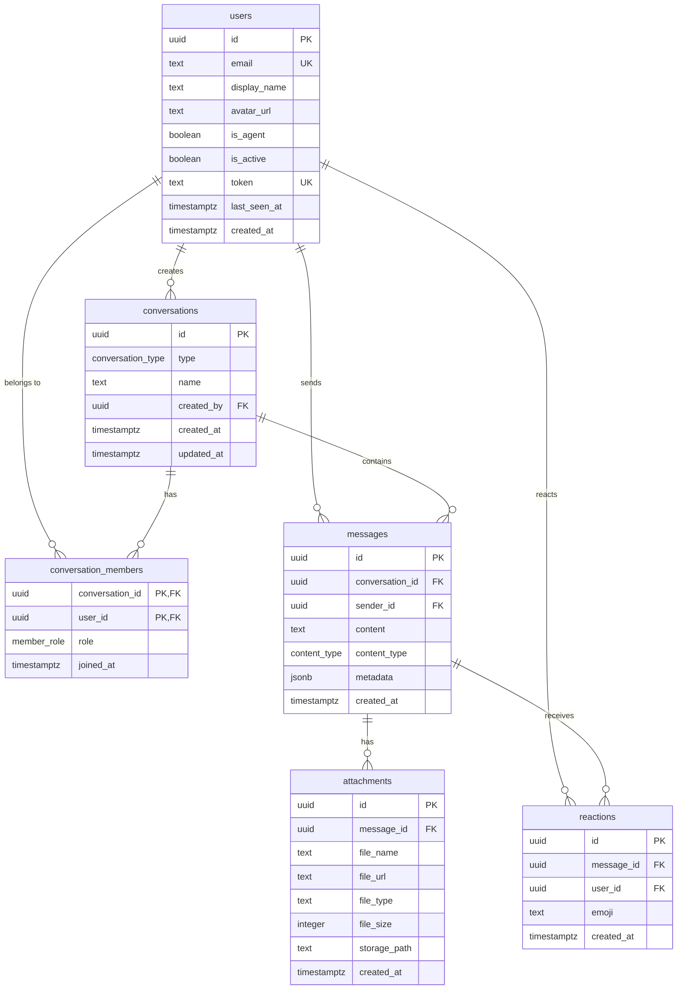

# Database Detailed Design

**Backend:** Supabase (PostgreSQL)
**Auth:** Token-based (admin-provisioned), Supabase Auth for JWT sessions
**Realtime:** Supabase Realtime (Postgres Changes + Presence + Broadcast)

## 1. ER Diagram



## 2. Custom Types

```sql
-- Conversation type enum
CREATE TYPE conversation_type AS ENUM ('dm', 'group');

-- Member role enum
CREATE TYPE member_role AS ENUM ('admin', 'member');

-- Content type enum
CREATE TYPE content_type AS ENUM ('text', 'file', 'image', 'url');
```

## 3. Table Definitions

### E-01: users

Stores human users and AI agents. Admin provisions tokens manually.

| Column | Type | Constraints | Default | Description |
|--------|------|-------------|---------|-------------|
| `id` | `uuid` | PK | `gen_random_uuid()` | Unique user ID |
| `email` | `text` | UNIQUE, NOT NULL | — | User email (for display/identification) |
| `display_name` | `text` | NOT NULL | — | Display name shown in chat |
| `avatar_url` | `text` | NULLABLE | `NULL` | Profile avatar URL (Supabase Storage or external) |
| `is_agent` | `boolean` | NOT NULL | `false` | True for AI agent accounts |
| `is_active` | `boolean` | NOT NULL | `true` | Admin toggle. False = cannot log in |
| `token` | `text` | UNIQUE, NOT NULL | — | Pre-provisioned auth token (UUID v4) |
| `last_seen_at` | `timestamptz` | NULLABLE | `NULL` | Last activity timestamp (updated on disconnect) |
| `created_at` | `timestamptz` | NOT NULL | `now()` | Account creation time |

**Indexes:**
- `idx_users_token` — UNIQUE on `token` (login lookup)
- `idx_users_email` — UNIQUE on `email`
- `idx_users_is_active` — on `is_active` (filter active users)

---

### E-02: conversations

Container for DM (2 participants) or group (3+) conversations.

| Column | Type | Constraints | Default | Description |
|--------|------|-------------|---------|-------------|
| `id` | `uuid` | PK | `gen_random_uuid()` | Conversation ID |
| `type` | `conversation_type` | NOT NULL | — | `dm` or `group` |
| `name` | `text` | NULLABLE | `NULL` | Group name. NULL for DMs. |
| `created_by` | `uuid` | FK → users(id), NOT NULL | — | User who created the conversation |
| `created_at` | `timestamptz` | NOT NULL | `now()` | Creation timestamp |
| `updated_at` | `timestamptz` | NOT NULL | `now()` | Last message timestamp (for sort order) |

**Indexes:**
- `idx_conversations_updated_at` — on `updated_at DESC` (sidebar sort)
- `idx_conversations_created_by` — on `created_by`

**Trigger:**
- `update_conversation_updated_at` — After INSERT on `messages`, update `conversations.updated_at = now()` for the conversation.

---

### E-03: conversation_members

Join table linking users to conversations. Enforces access control.

| Column | Type | Constraints | Default | Description |
|--------|------|-------------|---------|-------------|
| `conversation_id` | `uuid` | PK, FK → conversations(id) ON DELETE CASCADE | — | Conversation reference |
| `user_id` | `uuid` | PK, FK → users(id) ON DELETE CASCADE | — | User reference |
| `role` | `member_role` | NOT NULL | `'member'` | `admin` (can manage members) or `member` |
| `joined_at` | `timestamptz` | NOT NULL | `now()` | When user joined |
| `last_read_at` | `timestamptz` | NULLABLE | `NULL` | Last message timestamp user has read (for unread count) |

**Indexes:**
- PK: `(conversation_id, user_id)`
- `idx_members_user_id` — on `user_id` (find user's conversations)

---

### E-04: messages

Chat messages. Content can be text (with markdown), file reference, image reference, or URL.

| Column | Type | Constraints | Default | Description |
|--------|------|-------------|---------|-------------|
| `id` | `uuid` | PK | `gen_random_uuid()` | Message ID |
| `conversation_id` | `uuid` | FK → conversations(id) ON DELETE CASCADE, NOT NULL | — | Parent conversation |
| `sender_id` | `uuid` | FK → users(id), NOT NULL | — | Message author |
| `content` | `text` | NOT NULL | — | Message text (markdown for text type, URL for url type) |
| `content_type` | `content_type` | NOT NULL | `'text'` | `text`, `file`, `image`, `url` |
| `metadata` | `jsonb` | NULLABLE | `NULL` | Extra data (OG preview, file info, etc.) |
| `created_at` | `timestamptz` | NOT NULL | `now()` | Send timestamp |

**Indexes:**
- `idx_messages_conversation_created` — on `(conversation_id, created_at DESC)` (message history pagination)
- `idx_messages_sender_id` — on `sender_id`

**metadata JSONB schema by content_type:**

| content_type | metadata fields |
|---|---|
| `text` | `null` |
| `file` | `{ "file_name": "doc.pdf", "file_size": 245000, "file_type": "application/pdf" }` |
| `image` | `{ "file_name": "photo.jpg", "width": 1200, "height": 800, "file_size": 150000 }` |
| `url` | `{ "og_title": "...", "og_description": "...", "og_image": "...", "favicon": "..." }` |

---

### E-05: attachments

Files uploaded to Supabase Storage and linked to messages.

| Column | Type | Constraints | Default | Description |
|--------|------|-------------|---------|-------------|
| `id` | `uuid` | PK | `gen_random_uuid()` | Attachment ID |
| `message_id` | `uuid` | FK → messages(id) ON DELETE CASCADE, NOT NULL | — | Parent message |
| `file_name` | `text` | NOT NULL | — | Original file name |
| `file_url` | `text` | NOT NULL | — | Supabase Storage public/signed URL |
| `file_type` | `text` | NOT NULL | — | MIME type (e.g. `image/png`, `application/pdf`) |
| `file_size` | `integer` | NOT NULL | — | File size in bytes |
| `storage_path` | `text` | NOT NULL | — | Supabase Storage path (e.g. `attachments/{conversation_id}/{uuid}.ext`) |
| `created_at` | `timestamptz` | NOT NULL | `now()` | Upload timestamp |

**Indexes:**
- `idx_attachments_message_id` — on `message_id`
- `idx_attachments_conversation` — on storage_path prefix (for shared files query)

**Storage bucket:** `attachments`
- Path pattern: `{conversation_id}/{message_id}/{filename}`
- Max file size: 10MB
- Allowed MIME types: `image/jpeg`, `image/png`, `image/gif`, `image/webp`, `application/pdf`, `text/plain`, `text/markdown`, `text/csv`

---

### E-06: reactions (Phase 3)

Emoji reactions on messages.

| Column | Type | Constraints | Default | Description |
|--------|------|-------------|---------|-------------|
| `id` | `uuid` | PK | `gen_random_uuid()` | Reaction ID |
| `message_id` | `uuid` | FK → messages(id) ON DELETE CASCADE, NOT NULL | — | Target message |
| `user_id` | `uuid` | FK → users(id) ON DELETE CASCADE, NOT NULL | — | User who reacted |
| `emoji` | `text` | NOT NULL | — | Emoji character (e.g. `👍`, `❤️`, `🎉`) |
| `created_at` | `timestamptz` | NOT NULL | `now()` | Reaction timestamp |

**Constraints:**
- UNIQUE: `(message_id, user_id, emoji)` — one reaction type per user per message

**Indexes:**
- `idx_reactions_message_id` — on `message_id` (load reactions for messages)

## 4. Row Level Security (RLS)

All tables have RLS enabled. Policies use `auth.uid()` from Supabase Auth JWT.

### users

```sql
-- Users can read all active users (for presence list)
CREATE POLICY "users_select" ON users FOR SELECT
  USING (is_active = true);

-- Users can update their own record (last_seen_at)
CREATE POLICY "users_update_self" ON users FOR UPDATE
  USING (auth.uid() = id)
  WITH CHECK (auth.uid() = id);
```

### conversations

```sql
-- Users can see conversations they are a member of
CREATE POLICY "conversations_select" ON conversations FOR SELECT
  USING (id IN (
    SELECT conversation_id FROM conversation_members WHERE user_id = auth.uid()
  ));

-- Any active user can create a conversation
CREATE POLICY "conversations_insert" ON conversations FOR INSERT
  WITH CHECK (auth.uid() = created_by);
```

### conversation_members

```sql
-- Users can see members of their conversations
CREATE POLICY "members_select" ON conversation_members FOR SELECT
  USING (conversation_id IN (
    SELECT conversation_id FROM conversation_members WHERE user_id = auth.uid()
  ));

-- Conversation admins can add members
CREATE POLICY "members_insert" ON conversation_members FOR INSERT
  WITH CHECK (
    conversation_id IN (
      SELECT conversation_id FROM conversation_members
      WHERE user_id = auth.uid() AND role = 'admin'
    )
  );

-- Conversation admins can remove members (or self-leave)
CREATE POLICY "members_delete" ON conversation_members FOR DELETE
  USING (
    user_id = auth.uid()
    OR conversation_id IN (
      SELECT conversation_id FROM conversation_members
      WHERE user_id = auth.uid() AND role = 'admin'
    )
  );
```

### messages

```sql
-- Users can read messages in their conversations
CREATE POLICY "messages_select" ON messages FOR SELECT
  USING (conversation_id IN (
    SELECT conversation_id FROM conversation_members WHERE user_id = auth.uid()
  ));

-- Users can send messages to their conversations
CREATE POLICY "messages_insert" ON messages FOR INSERT
  WITH CHECK (
    auth.uid() = sender_id
    AND conversation_id IN (
      SELECT conversation_id FROM conversation_members WHERE user_id = auth.uid()
    )
  );
```

### attachments

```sql
-- Users can see attachments in their conversations
CREATE POLICY "attachments_select" ON attachments FOR SELECT
  USING (message_id IN (
    SELECT id FROM messages WHERE conversation_id IN (
      SELECT conversation_id FROM conversation_members WHERE user_id = auth.uid()
    )
  ));

-- Users can create attachments for their own messages
CREATE POLICY "attachments_insert" ON attachments FOR INSERT
  WITH CHECK (message_id IN (
    SELECT id FROM messages WHERE sender_id = auth.uid()
  ));
```

### reactions (Phase 3)

```sql
-- Users can see reactions in their conversations
CREATE POLICY "reactions_select" ON reactions FOR SELECT
  USING (message_id IN (
    SELECT id FROM messages WHERE conversation_id IN (
      SELECT conversation_id FROM conversation_members WHERE user_id = auth.uid()
    )
  ));

-- Users can add reactions
CREATE POLICY "reactions_insert" ON reactions FOR INSERT
  WITH CHECK (auth.uid() = user_id);

-- Users can remove their own reactions
CREATE POLICY "reactions_delete" ON reactions FOR DELETE
  USING (auth.uid() = user_id);
```

## 5. Supabase Storage Policies

**Bucket:** `attachments`

```sql
-- Members can upload to their conversation's folder
CREATE POLICY "attachments_upload" ON storage.objects FOR INSERT
  WITH CHECK (
    bucket_id = 'attachments'
    AND (storage.foldername(name))[1] IN (
      SELECT conversation_id::text FROM conversation_members WHERE user_id = auth.uid()
    )
  );

-- Members can read files from their conversations
CREATE POLICY "attachments_read" ON storage.objects FOR SELECT
  USING (
    bucket_id = 'attachments'
    AND (storage.foldername(name))[1] IN (
      SELECT conversation_id::text FROM conversation_members WHERE user_id = auth.uid()
    )
  );
```

## 6. Database Functions

### Find or create DM conversation

```sql
CREATE OR REPLACE FUNCTION find_or_create_dm(other_user_id uuid)
RETURNS uuid AS $$
DECLARE
  existing_id uuid;
  new_id uuid;
BEGIN
  -- Check if DM already exists between these two users
  SELECT cm1.conversation_id INTO existing_id
  FROM conversation_members cm1
  JOIN conversation_members cm2 ON cm1.conversation_id = cm2.conversation_id
  JOIN conversations c ON c.id = cm1.conversation_id
  WHERE cm1.user_id = auth.uid()
    AND cm2.user_id = other_user_id
    AND c.type = 'dm';

  IF existing_id IS NOT NULL THEN
    RETURN existing_id;
  END IF;

  -- Create new DM
  INSERT INTO conversations (type, created_by)
  VALUES ('dm', auth.uid())
  RETURNING id INTO new_id;

  -- Add both members
  INSERT INTO conversation_members (conversation_id, user_id, role)
  VALUES
    (new_id, auth.uid(), 'admin'),
    (new_id, other_user_id, 'member');

  RETURN new_id;
END;
$$ LANGUAGE plpgsql SECURITY DEFINER;
```

### Get unread count per conversation

```sql
CREATE OR REPLACE FUNCTION get_unread_counts()
RETURNS TABLE(conversation_id uuid, unread_count bigint) AS $$
BEGIN
  RETURN QUERY
  SELECT
    cm.conversation_id,
    COUNT(m.id) AS unread_count
  FROM conversation_members cm
  LEFT JOIN messages m ON m.conversation_id = cm.conversation_id
    AND m.created_at > COALESCE(cm.last_read_at, '1970-01-01'::timestamptz)
    AND m.sender_id != auth.uid()
  WHERE cm.user_id = auth.uid()
  GROUP BY cm.conversation_id;
END;
$$ LANGUAGE plpgsql SECURITY DEFINER;
```

### Update last_read_at

```sql
CREATE OR REPLACE FUNCTION mark_conversation_read(conv_id uuid)
RETURNS void AS $$
BEGIN
  UPDATE conversation_members
  SET last_read_at = now()
  WHERE conversation_id = conv_id AND user_id = auth.uid();
END;
$$ LANGUAGE plpgsql SECURITY DEFINER;
```

## 7. Realtime Configuration

### Postgres Changes (message delivery)

```sql
-- Enable realtime on messages table
ALTER PUBLICATION supabase_realtime ADD TABLE messages;
```

Frontend subscribes per conversation:
```
supabase.channel('messages:{conversation_id}')
  .on('postgres_changes', { event: 'INSERT', schema: 'public', table: 'messages', filter: 'conversation_id=eq.{id}' })
```

### Presence (online status)

Frontend tracks presence via a shared channel:
```
supabase.channel('presence')
  .on('presence', { event: 'sync' })
  .on('presence', { event: 'join' })
  .on('presence', { event: 'leave' })
  .subscribe()
```

### Broadcast (typing indicators — Phase 3)

```
supabase.channel('typing:{conversation_id}')
  .on('broadcast', { event: 'typing' })
  .subscribe()
```

## 8. Traceability

| Entity | SRD ID | Features |
|--------|--------|----------|
| users | E-01 | FR-01, FR-02, FR-03, FR-09, FR-14, FR-15 |
| conversations | E-02 | FR-04, FR-05, FR-13 |
| conversation_members | E-03 | FR-04, FR-05, FR-13, FR-17 |
| messages | E-04 | FR-06, FR-07, FR-08, FR-10, FR-12, FR-14 |
| attachments | E-05 | FR-10, FR-11 |
| reactions | E-06 | FR-18 |
