# System Architecture

**Last updated:** 2026-03-23
**Version:** 1.4.0

## Overview

Agent Playground is a chat-based collaboration platform where humans and AI agents work together through conversations with easy API integration via webhooks. Future direction: more tools and public agents.

**Stack:** Next.js 16 (React 19) | Supabase (PostgreSQL, Realtime, Auth, Storage, Edge Functions) | Tailwind CSS 4 | React Query v5 (TanStack)

## Data Caching Architecture

Three-tier caching strategy eliminates blank screens and provides instant navigation across conversations and workspaces.

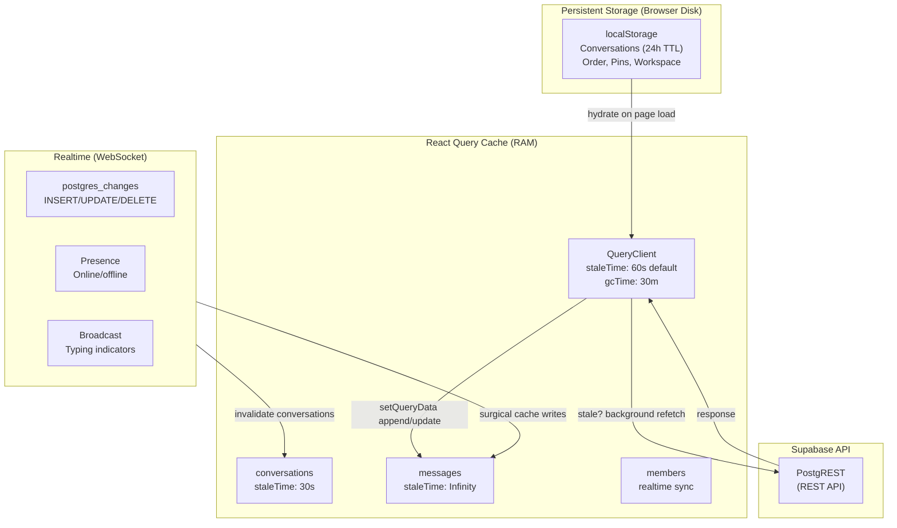

**Layer 1: localStorage (Disk)**
- **conversations** — Cached per workspace, 24h TTL
- **workspace order** — Conversation DnD order
- **pins** — User's pinned conversations
- **active workspace** — User's workspace context
- Purpose: Cross-session persistence, instant app open

**Layer 2: React Query Cache (Memory)**
- **conversations** — staleTime 30s, background refetch on mount
- **messages** — staleTime Infinity (realtime-driven), paginated infinite query
- **members** — staleTime varies, realtime subscription
- **user** — Manual invalidation on profile change
- **Query keys scoped by workspaceId** — Conversations from workspace A don't interfere with workspace B

**Layer 3: Realtime (WebSocket)**
- **postgres_changes** — Surgical cache updates via setQueryData (append messages, refresh conversations)
- **presence** — Online status, no cache layer (ephemeral state)
- **broadcast** — Typing indicators (ephemeral state)
- **Latency:** <500ms for messages, <2s for presence

**No blank screens because:**
1. Open app → localStorage hydrates conversations immediately
2. Switch conversation → cached messages render instantly (paginated load more on scroll)
3. Switch workspace → stale conversations displayed immediately, background refetch in progress
4. Realtime updates append/update cache without full refetch

## System Diagram

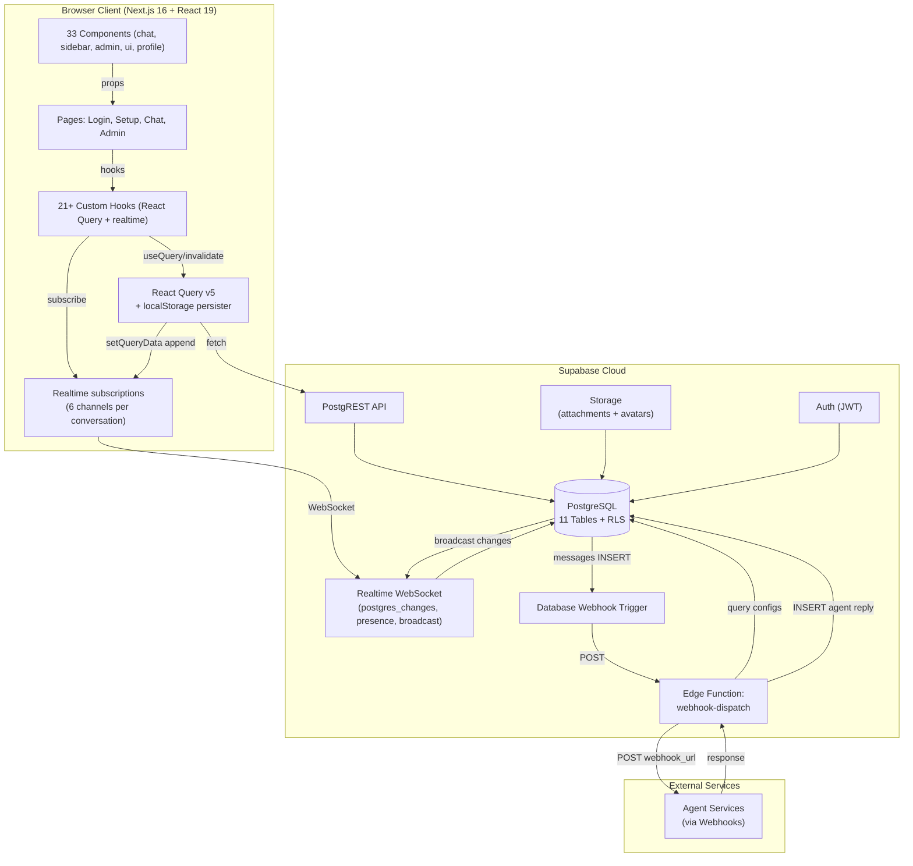

## Authentication Flow

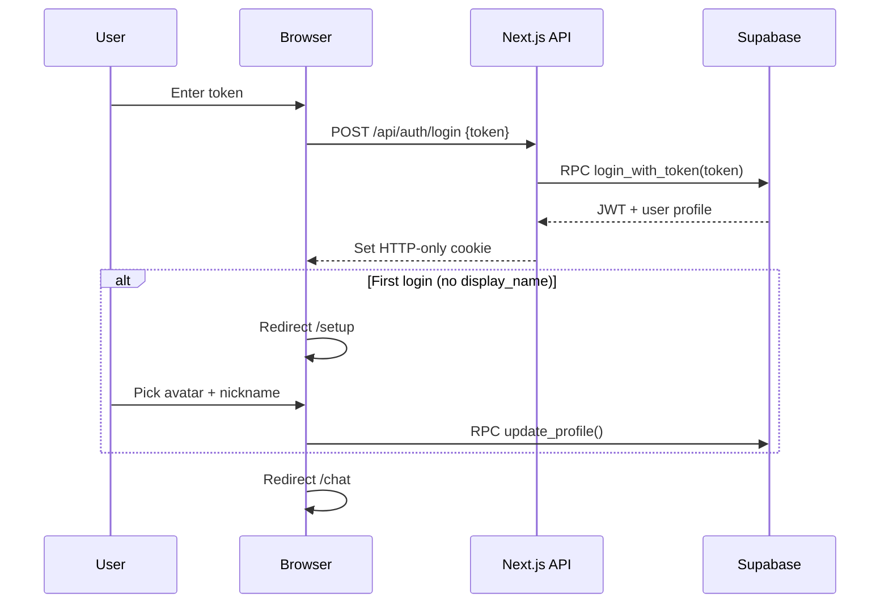

**Key decisions:**
- Pre-provisioned 64-char tokens (admin-generated) — no email/password
- JWT stored in HTTP-only secure cookie
- Middleware validates JWT on every `/chat/*` and `/setup` request
- Token cached in localStorage for auto-login on revisit

## Authorization (Row Level Security)

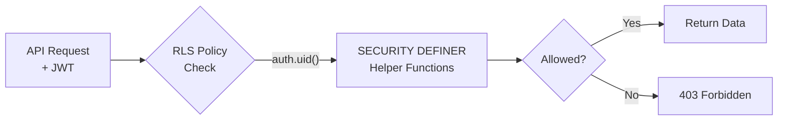

**SECURITY DEFINER helpers** (bypass RLS to prevent circular dependencies):

| Function | Purpose |
|----------|---------|
| `is_admin()` | Check if current user is admin |
| `my_conversation_ids()` | Get conversation IDs user belongs to |
| `is_conversation_member(conv)` | Verify membership |
| `is_conversation_admin(conv)` | Verify admin role |
| `get_conversation_members(conv)` | Return members (bypasses users RLS) |

All access control enforced at database level — no application-level authorization needed.

## Realtime Architecture

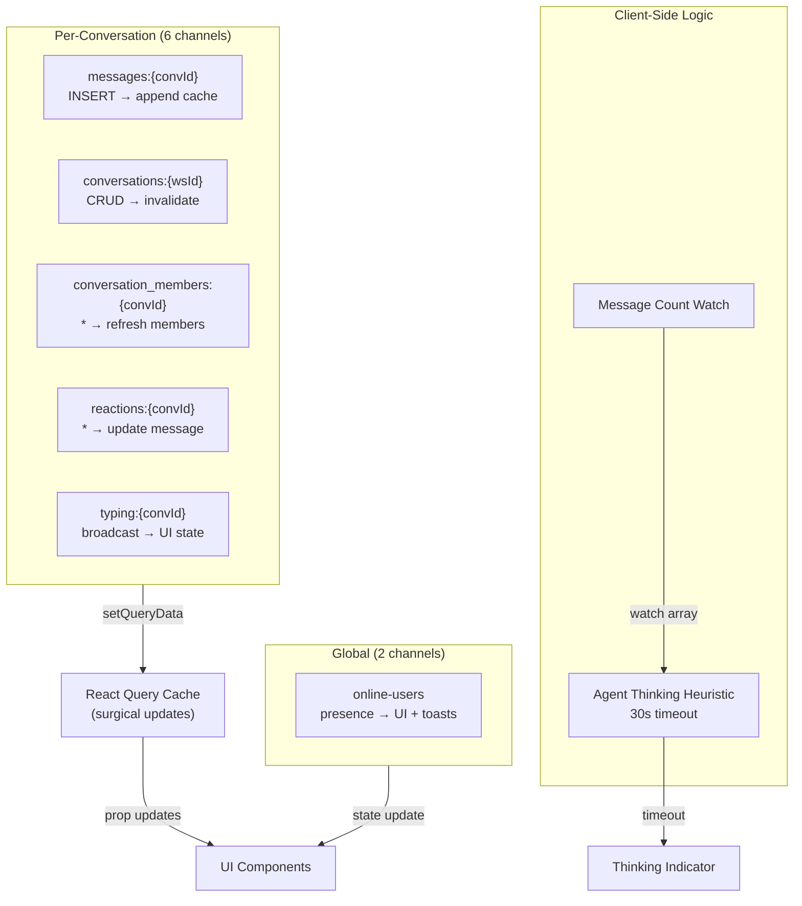

**Subscriptions per Conversation Context:**

| Channel | Event Type | Cache Handler | Use Case | Latency |
|---------|------------|----------------|----------|---------|
| `messages:{convId}` | postgres_changes INSERT | setQueryData append | New message + optimistic | <100ms |
| `conversations:{wsId}` | postgres_changes CRUD | invalidateQueries | Conv name/archived change | <500ms |
| `conversation_members:{convId}` | postgres_changes all | refresh query | Member added/removed/role | <500ms |
| `reactions:{convId}` | postgres_changes all | setQueryData update | Emoji added/removed | <100ms |
| `typing:{convId}` | broadcast message | React state | User is typing... | <50ms |
| `online-users` | presence sync/join/leave | React state | Online status display | <2s |

**Workspace-Scoped Isolation:**
- Query keys include `workspaceId` to prevent cross-workspace cache collisions
- Switching workspaces invalidates only stale conversations (preserves messages from current workspace)
- Presence only broadcasts within workspace context

**Cache Update Patterns:**
- **Append pattern:** Message INSERT → page count unchanged, just append to last page
- **Invalidate pattern:** Conversation type/membership change → full conversation refetch
- **Update pattern:** Reaction add/remove → update message object in cache
- All mutations optimistic: UI updates immediately, server sync in background

## Data Flow: Message Sending

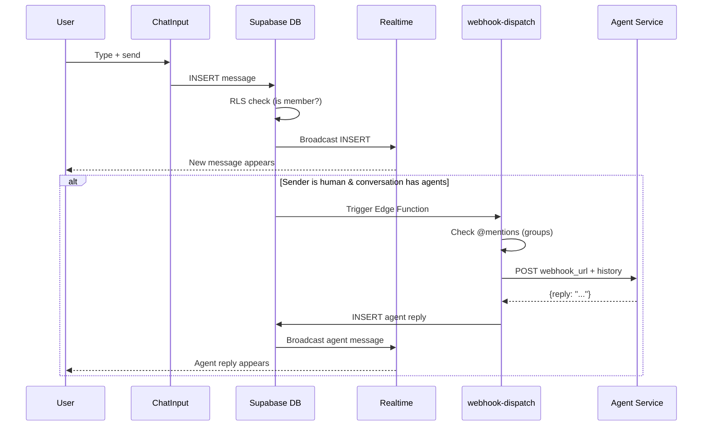

## Webhook Dispatch Architecture

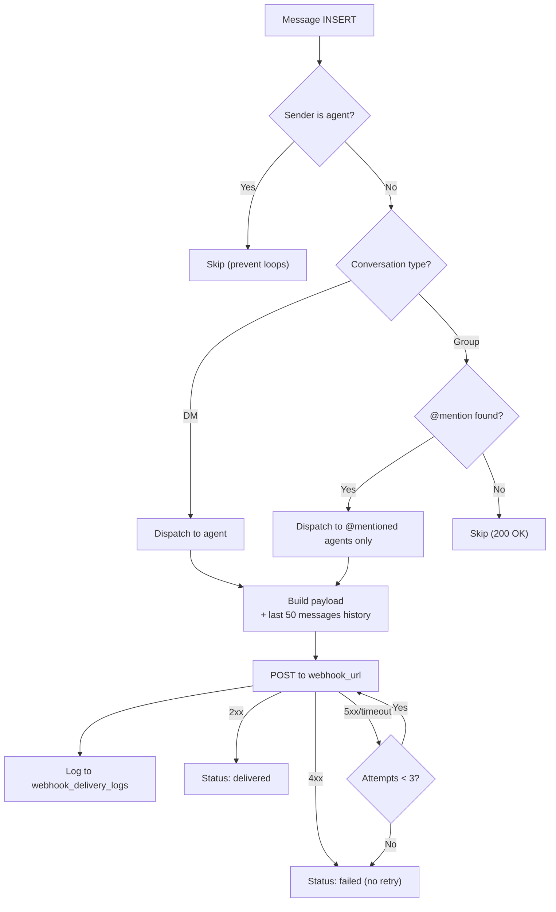

**Webhook payload includes:**
- Message content, sender info, conversation metadata
- Last 50 messages as conversation history (for agent context)
- Security headers: HMAC-SHA256 signature, webhook ID, timestamp

**Retry policy:** 3 attempts max (immediate, +10s, +60s). 30s timeout per attempt.

## File Upload Architecture

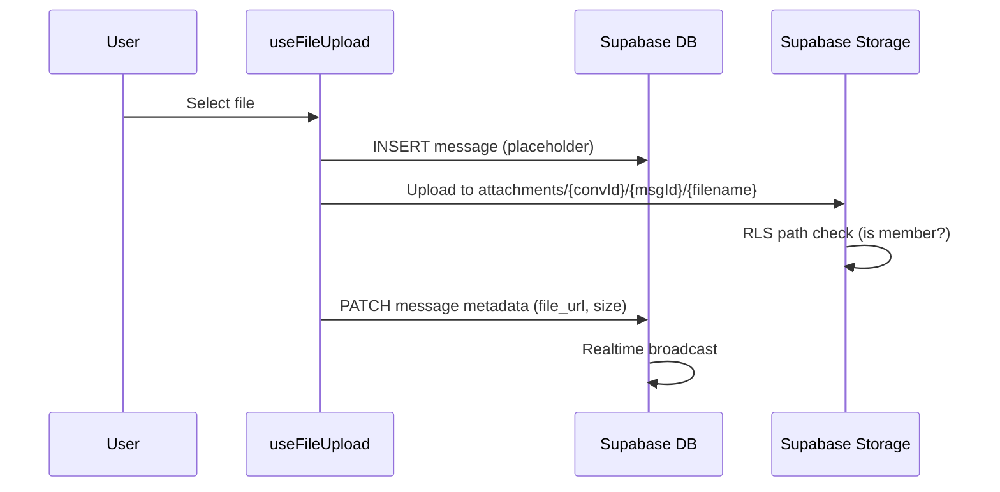

**Storage path:** `attachments/{conversationId}/{messageId}/{filename}`
**Limits:** 10MB per file | Signed URLs (1h expiry) | RLS-enforced access

## Avatar Upload Architecture

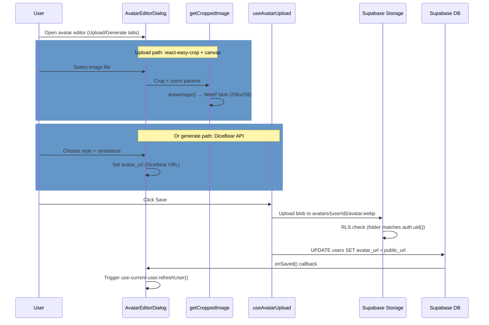

**Storage path:** `avatars/{userId}/avatar.webp` (public bucket)
**RLS Policies:** Users can upload/update own avatar only; all authenticated users can read
**Image handling:** Upload mode → canvas crop to 256x256 WebP | Generate mode → DiceBear SVG URL
**Cache-busting:** Public URL appended with `?t={timestamp}` to force fresh load
**Styles available:** 17 DiceBear styles (adventurer, avataaars, bottts, glass, identicon, pixel-art, shapes, etc.)

## Database Schema

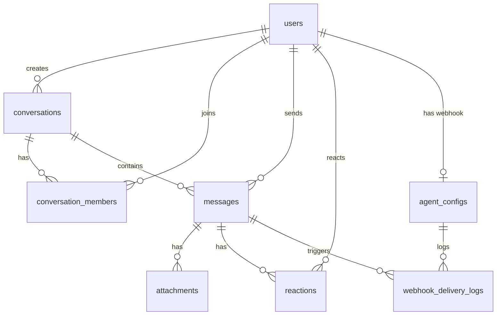

**11 tables** with RLS on all:

| Table | Purpose |
|-------|---------|
| `users` | Humans + agents (role, token, avatar_url, is_mock, is_active) |
| `conversations` | DMs and groups (type, name, is_archived) |
| `conversation_members` | Membership + roles + last_read_at |
| `messages` | Chat messages (content, content_type, metadata JSONB) |
| `attachments` | File metadata (name, URL, size, storage path) |
| `reactions` | Emoji reactions (one per user per message) |
| `agent_configs` | Webhook URL + secret + active toggle (one per agent) |
| `webhook_delivery_logs` | Dispatch history (status, attempts, request/response) |
| `workspaces` | Workspace containers (name, color) |
| `workspace_members` | Workspace membership + roles |
| `user_sessions` | Multi-device session tracking (3-session cap) |

**Storage buckets:**
- `attachments` (private) — Message files, scoped by conversation
- `avatars` (public) — User profile pictures, scoped by user ID

**20 migrations** applied sequentially from initial schema through avatar storage setup, workspace support, and realtime enablement.

## Mobile Responsive Architecture

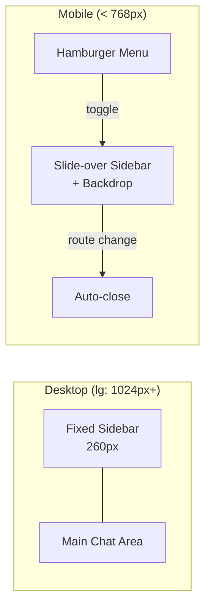

**MobileSidebarProvider** context wraps chat layout. Manages sidebar visibility, prevents body scroll when open.

## Conversation Pinning

- **Storage:** Browser localStorage (`pinned_conversations_{userId}`)
- **Behavior:** Pinned conversations sorted to top (alphabetical), unpinned sorted by recency
- **Scope:** Client-side preference, not synced across devices

## Presence Toasts

- **Trigger:** `use-supabase-presence` detects new online users (humans only, skip self/agents)
- **Display:** Sonner toast with avatar + "User is now online"
- **Latency:** < 2s from status change

## Screen Flow

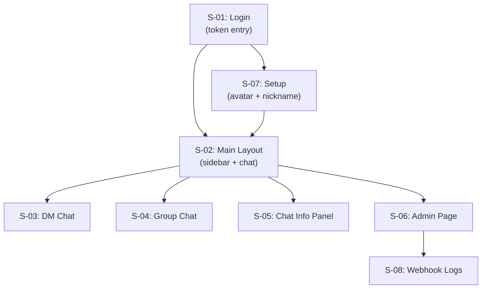

## Security Summary

| Area | Status | Details |
|------|--------|---------|
| Authentication | Secure | Pre-provisioned tokens, JWT in HTTP-only cookie |
| Authorization | Secure | RLS on all tables, SECURITY DEFINER helpers |
| File access | Secure | Signed URLs, conversation-scoped paths |
| Data in transit | Secure | HTTPS + WSS |
| Data at rest | Plaintext | No encryption at rest (acceptable for MVP) |
| Rate limiting | Not implemented | Potential DoS risk at scale |
| Webhook security | HMAC-SHA256 | Signature verification available |

## Scaling Considerations

| Scale | Strategy |
|-------|----------|
| Messages | Pagination (50/page), index on (conversation_id, created_at DESC) |
| Realtime | Per-conversation channels, presence deduplication |
| Files | Signed URLs (no public access), 10MB limit |
| Webhooks | 3 retries max, 30s timeout, log retention (30-day recommended) |
| Users | RLS handles filtering, client-side caching in hooks |

**Current capacity:** < 50 concurrent users (Supabase free tier: 500 realtime connections)

## Deployment

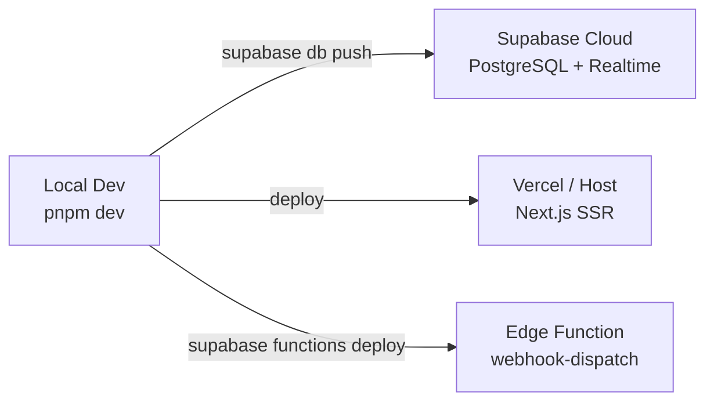

**Checklist:** Supabase project, env vars, migrations, seed data, RLS enabled, Realtime on messages, Storage bucket, Edge Function deployed, DB webhook connected, CORS configured.

## GoClaw Bridge Integration

Bridge API route connecting webhook-dispatch to GoClaw's persistent WebSocket connection. Each agent in `agent_configs` can optionally map to a GoClaw agent via `metadata.goclaw_agent_key`. Streaming messages are inserted into the database with `streaming_status` metadata; agent lifecycle events (run.started, tool.call, tool.result) are captured and displayed as status text.

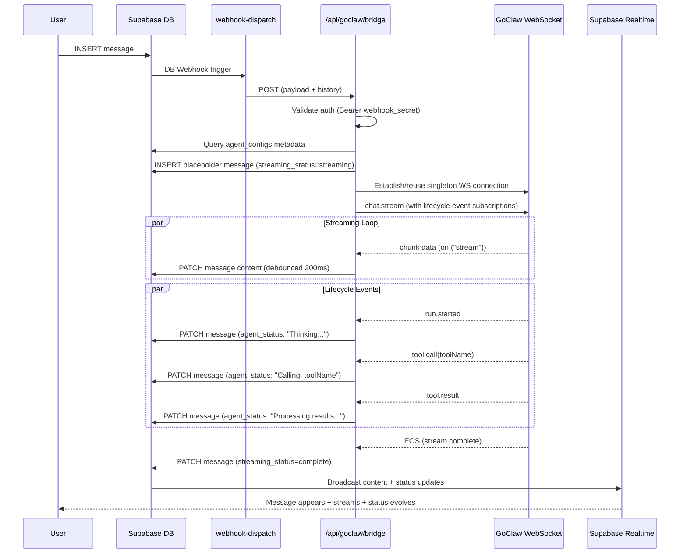

### Environment Variables

| Variable | Purpose |
|----------|---------|
| `GOCLAW_URL` | GoClaw server base URL (server-side only) |
| `GOCLAW_GATEWAY_TOKEN` | Auth token for GoClaw API (server-side only) |
| `NEXT_PUBLIC_GOCLAW_URL` | GoClaw URL for admin UI auto-fill (public) |

### Setup

1. Deploy GoClaw server (or use existing)
2. Set `GOCLAW_URL` and `GOCLAW_GATEWAY_TOKEN` in `.env`
3. Set `NEXT_PUBLIC_GOCLAW_URL` in `.env` (for admin UI auto-fill)
4. Run migration `023_agent_configs_metadata.sql`
5. Create agent in Admin panel
6. Set webhook URL to `https://<your-app>/api/goclaw/bridge`
7. Set webhook secret (required for GoClaw agents)
8. Set health check URL to `https://<goclaw-server>/health`
9. Set GoClaw Agent Key to match agent key in GoClaw config
10. Send a message to test

### Key Files

| File | Purpose |
|------|---------|
| `src/lib/goclaw/ws-client.ts` | GoClaw WebSocket client (singleton, reconnect, stream/send) |
| `src/lib/goclaw/index.ts` | Singleton client factory + export |
| `src/app/api/goclaw/bridge/route.ts` | Bridge API route (auth, streaming, lifecycle events, SSRF check) |
| `src/app/api/goclaw/test/route.ts` | Health check proxy for admin UI |
| `src/components/chat/message-item.tsx` | UI components for streaming messages (StreamingContent, AgentTextContent) |
| `supabase/migrations/023_agent_configs_metadata.sql` | Adds metadata JSONB column |

## Future Direction

- More tools integration (beyond webhooks)
- Public agent marketplace
- Project collaboration features (beyond conversations)
- Message search, editing, user blocking
