# System Architecture

**Last updated:** 2026-03-17

## Overview

Agent Playground is a chat-based collaboration platform where humans and AI agents work together through conversations with easy API integration via webhooks. Future direction: more tools and public agents.

**Stack:** Next.js 16 (React 19) | Supabase (PostgreSQL, Realtime, Auth, Storage, Edge Functions) | Tailwind CSS 4

## System Diagram

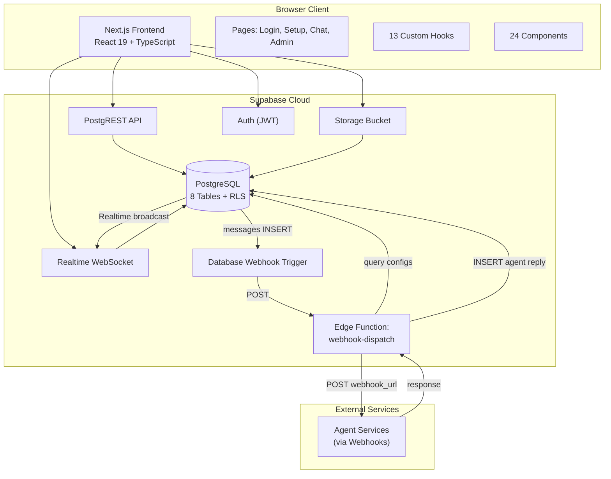

## Authentication Flow

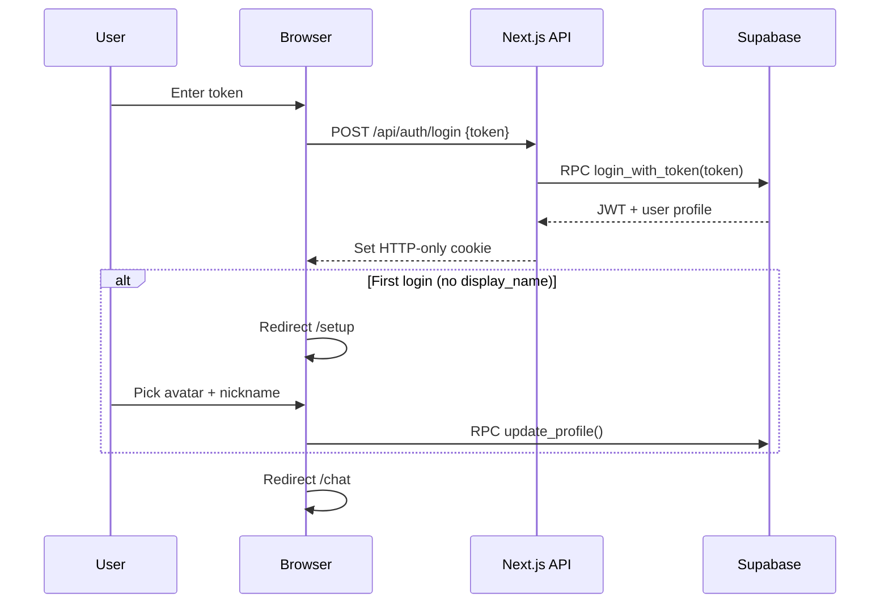

**Key decisions:**
- Pre-provisioned 64-char tokens (admin-generated) — no email/password
- JWT stored in HTTP-only secure cookie
- Middleware validates JWT on every `/chat/*` and `/setup` request
- Token cached in localStorage for auto-login on revisit

## Authorization (Row Level Security)

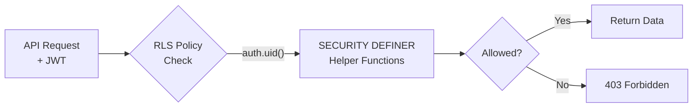

**SECURITY DEFINER helpers** (bypass RLS to prevent circular dependencies):

| Function | Purpose |
|----------|---------|
| `is_admin()` | Check if current user is admin |
| `my_conversation_ids()` | Get conversation IDs user belongs to |
| `is_conversation_member(conv)` | Verify membership |
| `is_conversation_admin(conv)` | Verify admin role |
| `get_conversation_members(conv)` | Return members (bypasses users RLS) |

All access control enforced at database level — no application-level authorization needed.

## Realtime Architecture

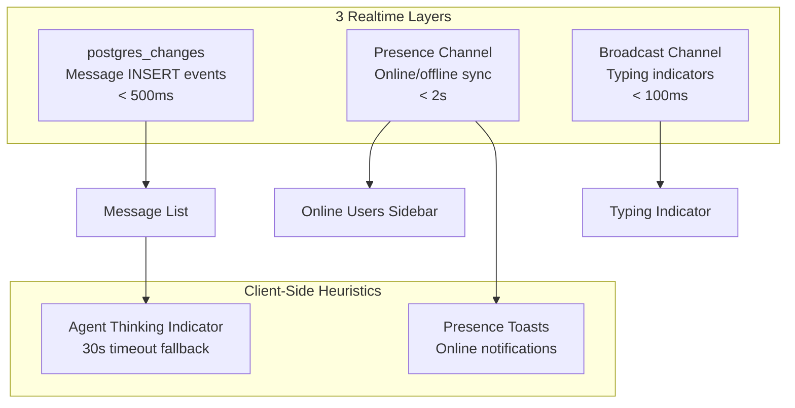

| Layer | Channel | Event | Use |
|-------|---------|-------|-----|
| Postgres Changes | `messages:{convId}` | INSERT | Real-time message delivery |
| Presence | `online-users` | sync/join/leave | Online status tracking |
| Broadcast | `typing:{convId}` | typing | "User is typing..." |
| Client heuristic | — | message array watch | "Agent is thinking..." (30s timeout) |

## Data Flow: Message Sending

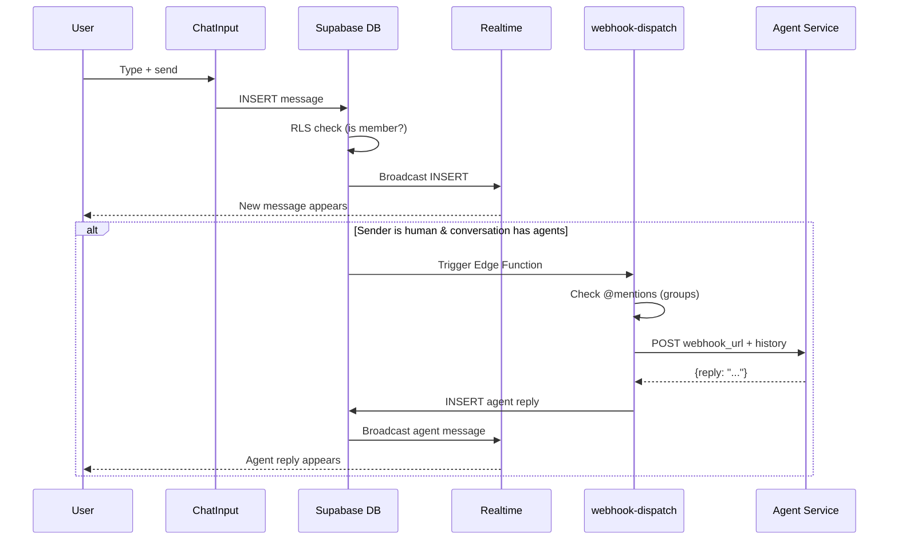

## Webhook Dispatch Architecture

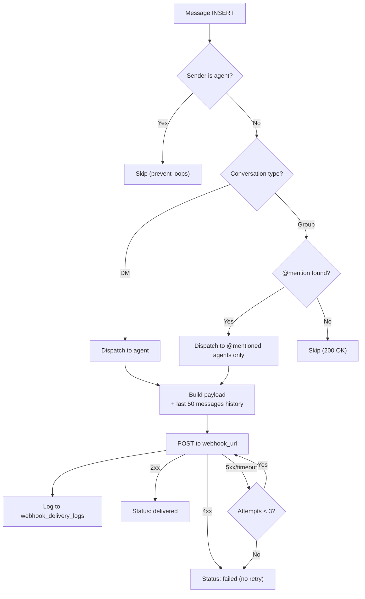

**Webhook payload includes:**
- Message content, sender info, conversation metadata
- Last 50 messages as conversation history (for agent context)
- Security headers: HMAC-SHA256 signature, webhook ID, timestamp

**Retry policy:** 3 attempts max (immediate, +10s, +60s). 30s timeout per attempt.

## File Upload Architecture

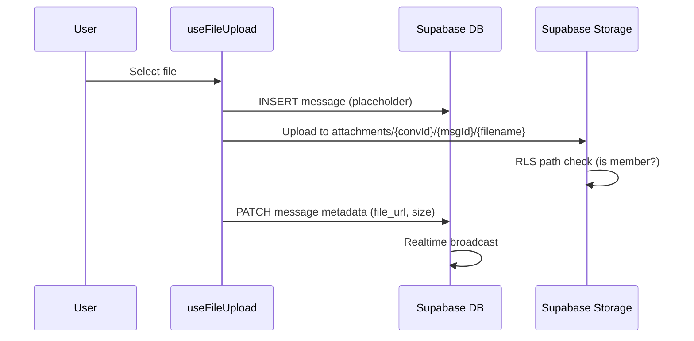

**Storage path:** `attachments/{conversationId}/{messageId}/{filename}`
**Limits:** 10MB per file | Signed URLs (1h expiry) | RLS-enforced access

## Database Schema

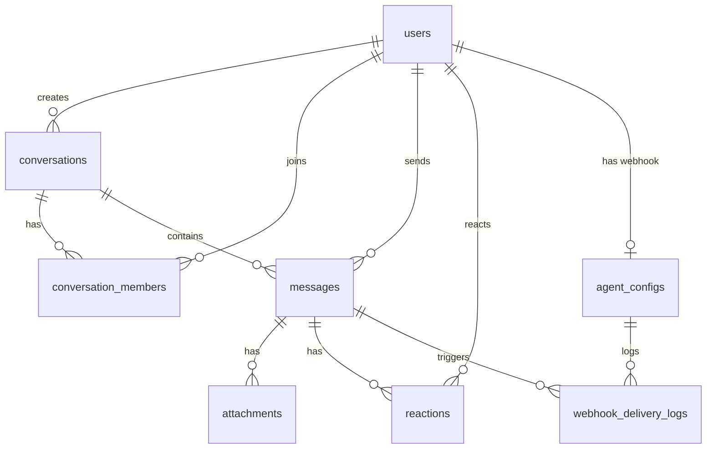

**8 tables** with RLS on all:

| Table | Purpose |
|-------|---------|
| `users` | Humans + agents (role, token, avatar, is_mock, is_active) |
| `conversations` | DMs and groups (type, name, is_archived) |
| `conversation_members` | Membership + roles + last_read_at |
| `messages` | Chat messages (content, content_type, metadata JSONB) |
| `attachments` | File metadata (name, URL, size, storage path) |
| `reactions` | Emoji reactions (one per user per message) |
| `agent_configs` | Webhook URL + secret + active toggle (one per agent) |
| `webhook_delivery_logs` | Dispatch history (status, attempts, request/response) |

**11 migrations** applied sequentially from initial schema through conversation members function.

## Mobile Responsive Architecture

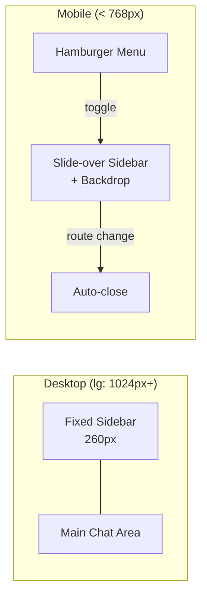

**MobileSidebarProvider** context wraps chat layout. Manages sidebar visibility, prevents body scroll when open.

## Conversation Pinning

- **Storage:** Browser localStorage (`pinned_conversations_{userId}`)
- **Behavior:** Pinned conversations sorted to top (alphabetical), unpinned sorted by recency
- **Scope:** Client-side preference, not synced across devices

## Presence Toasts

- **Trigger:** `use-supabase-presence` detects new online users (humans only, skip self/agents)
- **Display:** Sonner toast with avatar + "User is now online"
- **Latency:** < 2s from status change

## Screen Flow

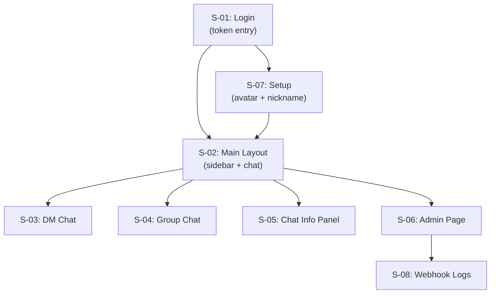

## Security Summary

| Area | Status | Details |
|------|--------|---------|
| Authentication | Secure | Pre-provisioned tokens, JWT in HTTP-only cookie |
| Authorization | Secure | RLS on all tables, SECURITY DEFINER helpers |
| File access | Secure | Signed URLs, conversation-scoped paths |
| Data in transit | Secure | HTTPS + WSS |
| Data at rest | Plaintext | No encryption at rest (acceptable for MVP) |
| Rate limiting | Not implemented | Potential DoS risk at scale |
| Webhook security | HMAC-SHA256 | Signature verification available |

## Scaling Considerations

| Scale | Strategy |
|-------|----------|
| Messages | Pagination (50/page), index on (conversation_id, created_at DESC) |
| Realtime | Per-conversation channels, presence deduplication |
| Files | Signed URLs (no public access), 10MB limit |
| Webhooks | 3 retries max, 30s timeout, log retention (30-day recommended) |
| Users | RLS handles filtering, client-side caching in hooks |

**Current capacity:** < 50 concurrent users (Supabase free tier: 500 realtime connections)

## Deployment

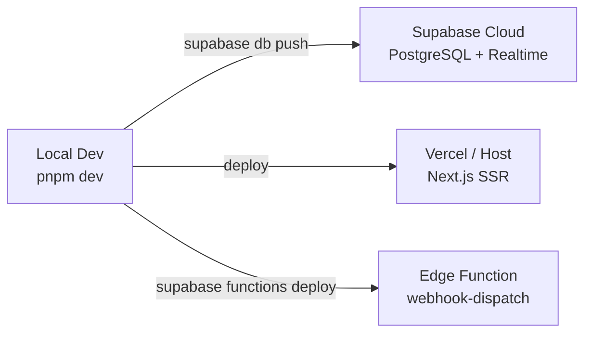

**Checklist:** Supabase project, env vars, migrations, seed data, RLS enabled, Realtime on messages, Storage bucket, Edge Function deployed, DB webhook connected, CORS configured.

## Future Direction

- More tools integration (beyond webhooks)
- Public agent marketplace
- Project collaboration features (beyond conversations)
- Message search, editing, user blocking
