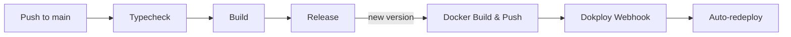

# Docker Release Pipeline for Dokploy

## Overview

Add Docker image build + GHCR push + Dokploy webhook to existing CI pipeline. Triggered only on new semantic-release versions.

## Pipeline Flow

## Phases

| # | Phase | Status | Files |
|---|-------|--------|-------|
| 1 | Fix Dockerfile for CI builds | ⏳ | `Dockerfile` |
| 2 | Add Docker job to CI workflow | ⏳ | `.github/workflows/ci.yml` |
| 3 | Manual: GitHub secrets + Dokploy config | ⏳ | (no code changes) |

## Key Decisions

- **Registry:** GHCR (ghcr.io) — free, native GitHub integration
- **Trigger:** After semantic-release creates new version
- **Tags:** `<semver>` + `latest`
- **Deploy:** Dokploy webhook auto-redeploy
- **Env:** `NEXT_PUBLIC_*` passed as build args; runtime env via Dokploy

## Dependencies

- Brainstorm: `plans/reports/brainstorm-260321-docker-release-pipeline.md`
