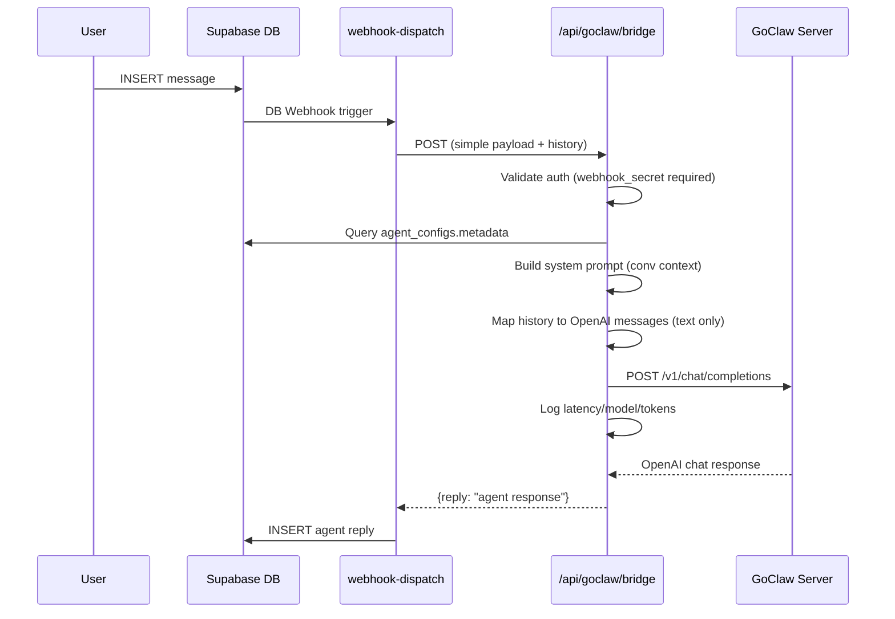

# GoClaw Webhook Bridge Integration

## Summary

Add a Next.js API route that bridges Agent Playground's webhook-dispatch Edge Function to GoClaw's `/v1/chat/completions` endpoint. GoClaw accepts OpenAI-format requests but returns its own response format (`{payload: {content, usage}}`). Each agent in `agent_configs` can optionally map to a GoClaw agent via a new `metadata` JSONB column.

## CEO Review Additions (Selective Expansion)

- Structured logging in bridge (GoClaw latency, model, token count — never log secrets)
- Auto-fill webhook_url + health_check_url when GoClaw agent key entered
- System message with conversation context prepended to messages array
- "Test Connection" button in admin UI
- Full error/rescue coverage (5 additional error paths)
- Require webhook_secret for GoClaw-backed agents
- Skip non-text messages in history mapping

## Architecture

## Phases

| # | Phase | Status | Effort | Files |
|---|-------|--------|--------|-------|
| 1 | [Database: Add metadata column](./phase-01-database-metadata.md) | complete | 15m | Migration SQL (user applies manually) |
| 2 | [Bridge API Route](./phase-02-bridge-api-route.md) | complete | 2h | `src/app/api/goclaw/bridge/route.ts`, `.env.example` |
| 3 | [Admin UI: GoClaw agent key field](./phase-03-admin-ui-goclaw-field.md) | complete | 1.5h | `webhook-config-form.tsx`, `use-agent-configs.ts`, `database.ts`, admin page |
| 4 | [Health Check + Env Config](./phase-04-health-check-env.md) | complete | 30m | `.env.example`, docs update |

## Key Decisions

- **metadata JSONB column** on `agent_configs` — flexible for future extensions, no schema lock-in
- **Bridge runs on Next.js API route** — reuses existing HTTPS deployment, no extra infra
- **Minimal webhook-dispatch change** — add `agent_id` to simplified payload (1 line) so bridge can identify the agent
- **GoClaw agent key in metadata** — `metadata.goclaw_agent_key` maps each Playground agent to a GoClaw agent
- **Bridge queries agent_configs itself** — query by agent_id from payload (~5ms)
- **System prompt queries member names** — one extra Supabase query for conversation_members (per user request)
- **webhook_secret required** for GoClaw-backed agents (security gate)
- **Non-text messages skipped** in history mapping (filter content_type === 'text')
- **Auto-fill URLs** only when field is empty or matches previous auto-fill (don't overwrite manual edits)

## Dependencies

- GoClaw server deployed and accessible via HTTPS
- `GOCLAW_URL` and `GOCLAW_GATEWAY_TOKEN` env vars set
- `NEXT_PUBLIC_SUPABASE_URL` and `SUPABASE_SERVICE_ROLE_KEY` env vars set (already required by app)
- User applies migration manually (NO auto-migration)
- Self-hosted deployment (no serverless timeout constraints)

## Risks

| Risk | Mitigation |
|------|------------|
| GoClaw downtime | Existing 3-retry logic in webhook-dispatch handles transient failures |
| Latency from double-hop | ~50ms overhead, negligible vs LLM response time (2-30s) |
| Long GoClaw responses | webhook-dispatch has 30s timeout; bridge uses 25s timeout |
| metadata column migration | Provide SQL script; user runs manually |
| GoClaw malformed response | Explicit try/catch with 502 + descriptive error |
| GoClaw rate limiting (429) | Forward 429 status; webhook-dispatch retries |
| Supabase connection failure | 500 + "DB unavailable"; webhook-dispatch retries |

## Error & Rescue Registry

| Codepath | Failure | Rescued | Action | User Sees |
|----------|---------|---------|--------|-----------|
| Parse body | Invalid JSON | Y | 400 | webhook log: failed |
| Validate auth | Missing/wrong secret | Y | 401 | webhook log: failed |
| Query agent_configs | DB connection fail | Y | 500 + "DB unavailable" | webhook retries |
| Query agent_configs | Agent not found | Y | 404 | webhook log: failed |
| No goclaw_key | Missing metadata key | Y | 400 | webhook log: failed |
| POST GoClaw | Timeout (25s) | Y | 504 Gateway Timeout | webhook retries |
| POST GoClaw | Auth rejected (401) | Y | 502 + "GoClaw auth" | webhook log: failed |
| POST GoClaw | Rate limited (429) | Y | 429 + retry-after | webhook retries |
| POST GoClaw | Server error (500) | Y | 502 + forward status | webhook retries |
| Parse response | Malformed JSON | Y | 502 + "Malformed response" | webhook log: failed |
| Extract choices | Empty choices[] | Y | 502 + "Empty response" | webhook log: failed |
| Extract content | Null content | Y | 502 + "No content" | webhook log: failed |
