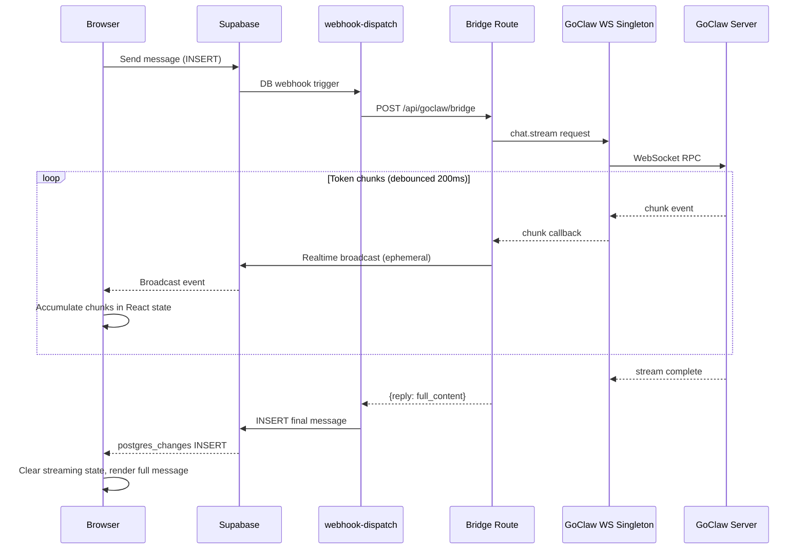

# GoClaw WebSocket Migration

**Date:** 2026-03-23
**Brainstorm:** [brainstorm-260323-goclaw-websocket-migration](../reports/brainstorm-260323-goclaw-websocket-migration.md)
**Research:** [researcher-260320-goclaw-integration](../reports/researcher-260320-goclaw-integration.md)

## Problem

GoClaw's REST API is unreliable (`/api/chat/messages` returns 405). REST is a compatibility shim — GoClaw is WebSocket-native. Current REST bridge causes 5-30s blank screens (no streaming) and lacks access to agent lifecycle events.

## Solution

Replace REST bridge with WebSocket RPC client. Server-side persistent singleton connection to GoClaw, streaming chunks delivered to frontend via Supabase Realtime **broadcast** events (ephemeral). Final message inserted by webhook-dispatch (unchanged).

**Deployment assumption:** WS singleton requires long-running Node.js process (`next start` / Docker). Does NOT work on Vercel serverless.

## Architecture

## Phases

| Phase | Description | Status | Effort |
|-------|-------------|--------|--------|
| [Phase 1](phase-01-ws-client-singleton.md) | WebSocket client singleton + connect/reconnect | complete | S |
| [Phase 2](phase-02-bridge-ws-integration.md) | Replace REST bridge with WS chat.stream | complete | M |
| [Phase 3](phase-03-streaming-message-ux.md) | Frontend streaming UX (progressive render) | complete | M |
| [Phase 4](phase-04-agent-lifecycle-events.md) | Agent lifecycle events (tool calls, run status) | complete | L |

## Key Decisions

- **WS location:** Server-side (keeps GOCLAW_TOKEN secret)
- **Chunk delivery:** Supabase Realtime broadcast (ephemeral, no DB writes during streaming)
- **Connection:** Persistent singleton with auto-reconnect (< 10 concurrent, requires `next start` / Docker)
- **REST fallback:** None (full replace)
- **Streaming state:** React local state (accumulated from broadcast), NOT database
- **Final message:** Inserted by webhook-dispatch (unchanged), clears streaming state
- **Tests:** WS client unit tests with mock server (Phase 1)
- **No webhook-dispatch changes needed** (broadcast approach eliminates coupling)

## Dependencies

- `ws` npm package
- GoClaw WebSocket endpoint accessible from Next.js server
- Frontend changes to render streaming messages

## Not In Scope

- Connection pool (YAGNI at < 10 concurrent)
- Client-side direct WS
- Multi-agent delegation/handoff
- Cost/usage tracking UI

## GSTACK REVIEW REPORT

| Review | Trigger | Why | Runs | Status | Findings |
|--------|---------|-----|------|--------|----------|
| CEO Review | `/plan-ceo-review` | Scope & strategy | 0 | — | — |
| Adversarial | `/codex review` | Independent 2nd opinion | 1 | CLEAR | 6 findings, all addressed |
| Eng Review | `/plan-eng-review` | Architecture & tests (required) | 2 | CLEAR | 7 issues, 0 critical gaps |
| Design Review | `/plan-design-review` | UI/UX gaps (FULL) | 1 | CLEAR | score: 4/10 → 9/10, 3 decisions |

- **CODEX:** Found metadata skip bug in realtime hook, sidebar thrash on chunk UPDATEs, metadata overwrite issue — all addressed by switching to broadcast approach
- **DESIGN:** Added visual state spec (dots → streaming → complete → error), block cursor with 0.8s pulse, amber warning badge for interrupted streams, instant dot-to-content transition
- **UNRESOLVED:** 0
- **VERDICT:** ENG + DESIGN CLEARED — ready to implement
